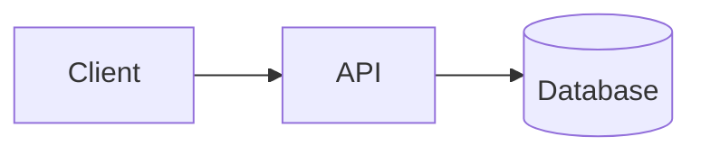

# md2star: Examples & Syntax Reference ⭐️

Welcome to the `md2star` syntax reference! Because `md2star` extends pure Pandoc by fixing annoying layout issues (especially surrounding bullet lists and `mermaid` blocks), you can format documents dynamically without breaking workflows.

Check out our pre-rendered examples inside the [`tests/examples/`](tests/examples) folder:
- 📄 **Word Document:** [`comprehensive_document.md`](tests/examples/comprehensive_document.md) ➡️ [`comprehensive_document.docx`](tests/examples/comprehensive_document.docx)
- 📊 **PowerPoint Deck:** [`comprehensive_presentation.md`](tests/examples/comprehensive_presentation.md) ➡️ [`comprehensive_presentation.pptx`](tests/examples/comprehensive_presentation.pptx)
- 🇫🇷 **French Document:** [`guide_complet_document_fr.md`](tests/examples/guide_complet_document_fr.md) ➡️ [`guide_complet_document_fr.docx`](tests/examples/guide_complet_document_fr.docx)
- 🎨 **Branded Slides:** [`branded_slides.md`](tests/examples/branded_slides.md) + [`Presentation1.pptx`](tests/examples/Presentation1.pptx) ➡️ [`branded_slides.pptx`](tests/examples/branded_slides.pptx)
- 🔖 **Footnotes:** [`footnotes_document.md`](tests/examples/footnotes_document.md) ➡️ [`footnotes_document.docx`](tests/examples/footnotes_document.docx)

To compile all examples at once:
```bash
cd tests/examples && ./run.sh
```

---

## 1. Title and Subtitles

`md2star` automatically extracts the first `# Heading` and uses it as the document **Title** metadata. If you use `--author`, the author string alongside the localized date constructs the **Subtitle**.

```bash
md2docx document.md --author "Someone Great"
```

The date is automatically localized based on the detected language:
- 🇫🇷 French → `dimanche 10 mai 2026`
- 🇪🇸 Spanish → `domingo, 10 de mayo de 2026`
- 🇩🇪 German → `Sonntag, 10. Mai 2026`

---

## 2. Mermaid Diagrams

Standard Pandoc breaks on ````mermaid` fenced code blocks. `md2star` automatically converts them to high-resolution PNGs using the Mermaid CLI locally; no data leaves your machine.

```markdown
Here is our pipeline architecture:

` ` `mermaid
graph LR;
    Raw[Markdown Source] --> Engine[md2star Preprocessor]
    Engine --> Office[DOCX/PPTX]
` ` `
```

> [!TIP]
> Mermaid rendering requires Node.js (≥16) on your PATH. The CLI is auto-installed via `npx` on first use.

---

## 3. Flawless List Formatting

Markdown writers often glue unordered lists directly to paragraphs, which breaks Pandoc output by forcing inline blocks. `md2star`'s Python AST engine automatically inserts the correct spacing so bullet lists always render cleanly.

```markdown
Our company provides:
- Seamless DOCX wrapping
- Deep PPTX grid-structuring
- Mathematics evaluations
```

*(This will always generate properly spaced Microsoft bullet items.)*

---

## 4. Multi-Column Slides (PPTX Only)

Divide your presentation slides into layout halves using `{.column}` spans:

```markdown
# Section Slide Architecture

This is my left paragraph.

{.column}

This is my right paragraph, structurally independent on the right side of the slide.
```

---

## 5. LaTeX Mathematics

Use native LaTeX expressions inside `$$` tags. Pandoc compiles them into Word / PowerPoint native Mathematical Equation objects.

```markdown
We evaluate the standard structural equation:

$$
e^{i \times \pi}+1 = 0
$$
```

---

## 6. Corporate Bibliographies

For large technical documents, `md2star` leverages native `.bib` libraries via `--bib`:

```markdown
Standard AI scaling laws have been deeply structured inside causality research metrics [@causality-pearl].
```

**Compilation:**
```bash
md2pptx presentation.md --bib references.bib --bibliography-name "References"
```

The `--bibliography-name` flag injects an automatic heading at the end of your document containing the compiled citation list.

---

## 7. Branded Templates (PPTX)

Use any custom `.pptx` as a reference template to brand your slides. If the template already has standard Pandoc layout names (`Title Slide`, `Title and Content`, etc.), use it directly:

```bash
md2pptx slides.md --reference-doc Presentation1.pptx
```

For corporate templates with non-standard layout names, use the
[md2star-adapt](https://github.com/warith-harchaoui/md2star-adapt) sibling
tool to build a compatible reference doc, then point md2pptx at it via
`--reference-doc branded_ref.pptx`.

---

## 8. Language Detection & Date Localization

`md2star` automatically detects the language of your content and localizes dates accordingly, no configuration needed. Supported languages include French, Spanish, German, Italian, Portuguese, Dutch, Russian, Chinese, and Japanese.

```markdown
# Test du langage

J'ai un "je ne sais quoi" que je ne connais pas.
```

```bash
md2docx document.md --author "Utilisateur"
# → Subtitle: "Utilisateur, dimanche 10 mai 2026"
```

You can override with explicit metadata:
```yaml
---
lang: fr-FR
date_format: "%A %e %B %Y"
---
```

---

## 9. Page Breaks (DOCX only)

A horizontal rule (`---` on its own line) is rewritten into a hard
page break in the DOCX output. The Lua filter only fires this
mapping for the DOCX writer: PPTX keeps the default horizontal-rule
rendering, because slide structure in PPTX already comes from `## `
headings and overloading `---` there would conflict with intent.

```markdown
# Page 1

The opening paragraph stays on page 1.

---

# Page 2

After the `---`, Word starts a brand-new page automatically.

---

## Even a subsection works

The page break fires for any standalone `---`, not only between
`# Heading 1` blocks.
```

**Compilation:**
```bash
md2docx pagebreaks.md
```

> [!TIP]
> The `---` must be on its **own line**, with blank lines above
> and below; that's the standard Pandoc horizontal-rule syntax.
> A `---` inside a YAML metadata block (the document's front
> matter) is not affected: Pandoc consumes it as metadata
> delimiter before the Lua filter ever sees it.

> [!NOTE]
> No equivalent in PPTX. To force a slide break, start a new
> `## Heading`; that's how Pandoc maps Markdown to PowerPoint
> slides.

---

## 10. Footnotes

Markdown footnotes pass straight through to **native Word footnotes**:
they land in the DOCX's `word/footnotes.xml` part, so Word renders
them at the bottom of the page with clickable superscript markers and
automatic renumbering. `md2star` does no special pre-processing here;
Pandoc's default Markdown reader has the `footnotes` extension on, so
the standard `[^label]` syntax just works.

```markdown
Structured evaluation shows a 12% gain.[^bench] The gain holds even
under adversarial inputs.[^adv]

[^bench]: Measured on the internal benchmark suite, 2026-Q2 run.
[^adv]: See the red-team appendix for the full protocol.
```

Labels are arbitrary identifiers (`[^1]`, `[^bench]`, `[^note-a]`);
Word reorders and renumbers the visible markers automatically, so the
label you choose never leaks into the output. You can also inline the
note directly with the `^[...]` form:

```markdown
The result reproduces across seeds.^[Ten seeds, variance under 1%.]
```

**Compilation:**
```bash
md2docx report.md
```

> [!TIP]
> Footnotes work in DOCX and PPTX alike. DOCX gets true bottom-of-page
> footnotes; PPTX collects each slide's notes into a small **"Notes"**
> text block appended to that slide's body (endnote-style, on the
> slide itself, not the speaker-notes pane). The marker-and-text
> pairing is preserved either way.

## 11. Reverse direction: the Markdown twin

Go the *other* way: turn a finished document back into an editable
Markdown source. `md2star twin` recovers prose + GFM tables, scrapes
every embedded image out to an `assets/` folder, and re-links them,
so the result is a real source you can edit and re-render, not a flat
text dump. Works on **any PDF, or anything LibreOffice can convert to
one** (`.docx`, `.pptx`, `.odt`, `.rtf`, `.html`, …). Needs the `[ocr]`
extra: `pip install 'md2star[ocr]'`.

```bash
# report.pdf  →  report.md + assets/img-p1-0.png …
md2star twin report.pdf --out ./recovered/

# prose + tables only, no scraped rasters
md2star twin report.pdf --no-images
```

Add `--diagrams` (opt-in, needs `[ocr]` + a local Ollama) and md2star
classifies each scraped image with a local vision model into three
buckets: **photos stay as PNGs**, **node-and-edge diagrams are
re-authored as Mermaid**, and other **vector figures** (charts, plots,
logos, icons, line drawings) are re-authored as an editable **SVG**
written beside the raster. Every candidate, Mermaid or SVG, is
verified by the same *target-matching eyeball loop*: render it (the
same `mmdc` the forward path uses for Mermaid; a detected rasteriser,
`cairosvg` / `rsvg-convert` / `inkscape` / ImageMagick, for SVG),
compare it against the scraped original with the VLM, and iterate until
it matches. The original PNG is always kept as a commented fallback, so
a reconstruction is never a lossy dead end.

```bash
# diagrams become editable Mermaid; photos stay PNGs
md2star twin architecture.pdf --diagrams --out ./recovered/
```

A recovered diagram lands in the twin like this: editable code, with
the source raster preserved beneath it:

````markdown


<!-- source figure:  -->
````

> [!TIP]
> The twin is the reverse of md2star's own output: render Markdown →
> DOCX/PDF with the forward CLIs, then `md2star twin` reads it back.
> Because a reconstructed diagram is Mermaid (which the forward path
> renders natively), the round-trip `md → doc → twin → doc` keeps
> diagrams as code the whole way.

### The twin in the GUI and over HTTP

The twin is not CLI-only. In the full editor (`md2star gui`), the
**Import** control has two toggles:

- **Twin**: keep scraped images. The recovered `<stem>.md` **and** an
  `assets/` folder are written into the folder you have open (so the
  image links resolve when you re-render), and the sidebar refreshes.
  Requires an open folder; plain **Import** stays a text-only load.
- **Mermaid**: additionally re-author node-and-edge figures via the
  local VLM (needs the `[ocr]` stack + Ollama). Implies **Twin**.

Over the HTTP API (`md2star-api`), `POST /extract` takes the same
options as form fields: text-only returns JSON, twin returns a zip of
`<stem>.md` + `assets/`:

```bash
# Text-only (JSON: {"filename": "report.md", "markdown": "..."})
curl -sF file=@report.pdf http://localhost:8000/extract

# Full twin (a report.zip containing report.md + assets/)
curl -sF file=@report.pdf -F twin=true \
     -o report.zip http://localhost:8000/extract

# Twin + AI diagram reconstruction (implies twin; needs the [ocr] stack)
curl -sF file=@architecture.pdf -F diagrams=true \
     -o architecture.zip http://localhost:8000/extract
```
