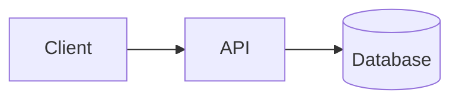

# md2star : exemples et aide-mémoire de syntaxe ⭐️

Bienvenue dans l'aide-mémoire de syntaxe de `md2star` ! Parce que `md2star` étend Pandoc pur en corrigeant des défauts de mise en page agaçants (en particulier autour des listes à puces et des blocs `mermaid`), vous pouvez mettre en forme vos documents dynamiquement sans casser vos flux de travail.

Les exemples pré-générés se trouvent dans le dossier [`tests/examples/`](tests/examples) :
- 📄 **Document Word :** [`comprehensive_document.md`](tests/examples/comprehensive_document.md) ➡️ [`comprehensive_document.docx`](tests/examples/comprehensive_document.docx)
- 📊 **Diaporama PowerPoint :** [`comprehensive_presentation.md`](tests/examples/comprehensive_presentation.md) ➡️ [`comprehensive_presentation.pptx`](tests/examples/comprehensive_presentation.pptx)
- 🇫🇷 **Document français :** [`guide_complet_document_fr.md`](tests/examples/guide_complet_document_fr.md) ➡️ [`guide_complet_document_fr.docx`](tests/examples/guide_complet_document_fr.docx)
- 🎨 **Diapositives de marque :** [`branded_slides.md`](tests/examples/branded_slides.md) + [`Presentation1.pptx`](tests/examples/Presentation1.pptx) ➡️ [`branded_slides.pptx`](tests/examples/branded_slides.pptx)
- 🔖 **Notes de bas de page :** [`footnotes_document.md`](tests/examples/footnotes_document.md) ➡️ [`footnotes_document.docx`](tests/examples/footnotes_document.docx)

Pour compiler tous les exemples d'un coup :
```bash
cd tests/examples && ./run.sh
```

---

## 1. Titre et sous-titres

`md2star` extrait automatiquement le premier `# Titre` et l'utilise comme métadonnée **Titre** du document. Avec `--author`, la chaîne d'auteur, accolée à la date localisée, construit le **Sous-titre**.

```bash
md2docx document.md --author "Someone Great"
```

La date est localisée automatiquement selon la langue détectée :
- 🇫🇷 Français → `dimanche 10 mai 2026`
- 🇪🇸 Espagnol → `domingo, 10 de mayo de 2026`
- 🇩🇪 Allemand → `Sonntag, 10. Mai 2026`

---

## 2. Diagrammes Mermaid

Pandoc standard échoue sur les blocs de code balisés ````mermaid`. `md2star` les convertit automatiquement en PNG haute résolution grâce au CLI Mermaid, exécuté localement : aucune donnée ne quitte votre machine.

```markdown
Voici l'architecture de notre pipeline :

` ` `mermaid
graph LR;
    Raw[Markdown Source] --> Engine[md2star Preprocessor]
    Engine --> Office[DOCX/PPTX]
` ` `
```

> [!TIP]
> Le rendu Mermaid nécessite Node.js (≥16) sur votre PATH. Le CLI s'installe automatiquement via `npx` au premier usage.

---

## 3. Des listes toujours bien formées

On colle souvent une liste à puces directement à un paragraphe, sans ligne vide : Pandoc, alors, force un rendu en bloc en ligne et casse la sortie. Le moteur AST Python de `md2star` insère l'espacement correct pour que les listes à puces s'affichent toujours proprement.

```markdown
Notre entreprise propose :
- Un habillage DOCX sans accroc
- Une structuration fine des grilles PPTX
- Des évaluations mathématiques
```

*(Cela produit toujours des puces Microsoft correctement espacées.)*

---

## 4. Diapositives à plusieurs colonnes (PPTX uniquement)

Divisez vos diapositives en deux moitiés grâce aux spans `{.column}` :

```markdown
# Section Slide Architecture

This is my left paragraph.

{.column}

This is my right paragraph, structurally independent on the right side of the slide.
```

---

## 5. Mathématiques LaTeX

Utilisez des expressions LaTeX natives entre balises `$$`. Pandoc les compile en objets Équation mathématique natifs de Word ou PowerPoint.

```markdown
Nous évaluons l'équation structurelle classique :

$$
e^{i \times \pi}+1 = 0
$$
```

---

## 6. Bibliographies pour documents d'entreprise

Pour les documents techniques volumineux, `md2star` s'appuie sur des bibliothèques `.bib` natives via `--bib` :

```markdown
Standard AI scaling laws have been deeply structured inside causality research metrics [@causality-pearl].
```

**Compilation :**
```bash
md2pptx presentation.md --bib references.bib --bibliography-name "References"
```

L'option `--bibliography-name` insère automatiquement, en fin de document, un titre suivi de la liste des citations compilées.

---

## 7. Modèles de marque (PPTX)

Utilisez n'importe quel `.pptx` comme modèle de référence pour habiller vos diapositives à votre marque. Si le modèle porte déjà les noms de mise en page standard de Pandoc (`Title Slide`, `Title and Content`, etc.), employez-le directement :

```bash
md2pptx slides.md --reference-doc Presentation1.pptx
```

Pour les modèles d'entreprise aux noms de mise en page non standard, utilisez
l'outil compagnon [md2star-adapt](https://github.com/warith-harchaoui/md2star-adapt)
pour construire un document de référence compatible, puis pointez `md2pptx`
vers lui avec `--reference-doc branded_ref.pptx`.

---

## 8. Détection de langue et localisation des dates

`md2star` détecte automatiquement la langue de votre contenu et localise les dates en conséquence, sans configuration. Langues prises en charge : français, espagnol, allemand, italien, portugais, néerlandais, russe, chinois et japonais.

```markdown
# Test du langage

J'ai un « je ne sais quoi » que je ne connais pas.
```

```bash
md2docx document.md --author "Utilisateur"
# → Sous-titre : « Utilisateur, dimanche 10 mai 2026 »
```

Vous pouvez forcer une valeur via des métadonnées explicites :
```yaml
---
lang: fr-FR
date_format: "%A %e %B %Y"
---
```

---

## 9. Sauts de page (DOCX uniquement)

Un filet horizontal (`---` seul sur sa ligne) se transforme en un vrai saut
de page dans la sortie DOCX. Le filtre Lua ne déclenche cette transformation
que pour l'écrivain DOCX : PPTX conserve le rendu par défaut du filet
horizontal, car la structure des diapositives en PPTX vient déjà des titres
`## ` ; y superposer `---` entrerait en conflit avec cette intention.

```markdown
# Page 1

The opening paragraph stays on page 1.

---

# Page 2

After the `---`, Word starts a brand-new page automatically.

---

## Even a subsection works

The page break fires for any standalone `---`, not only between
`# Heading 1` blocks.
```

**Compilation :**
```bash
md2docx pagebreaks.md
```

> [!TIP]
> Le `---` doit être seul sur sa **propre ligne**, entouré de lignes vides
> au-dessus et en dessous : c'est la syntaxe standard du filet horizontal
> Pandoc. Un `---` à l'intérieur d'un bloc de métadonnées YAML (l'en-tête du
> document) n'est pas concerné : Pandoc le consomme comme délimiteur de
> métadonnées avant même que le filtre Lua ne l'atteigne.

> [!NOTE]
> Aucun équivalent en PPTX. Pour forcer un changement de diapositive,
> commencez un nouveau `## Titre` : c'est ainsi que Pandoc fait correspondre
> le Markdown aux diapositives PowerPoint.

---

## 10. Notes de bas de page

Les notes de bas de page Markdown passent directement en **notes natives
Word** : elles atterrissent dans la partie `word/footnotes.xml` du DOCX, si
bien que Word les affiche en bas de page avec des appels de note cliquables
et une renumérotation automatique. `md2star` n'applique aucun prétraitement
particulier ici ; le lecteur Markdown par défaut de Pandoc a l'extension
`footnotes` activée, si bien que la syntaxe standard `[^label]` fonctionne
telle quelle.

```markdown
Structured evaluation shows a 12% gain.[^bench] The gain holds even
under adversarial inputs.[^adv]

[^bench]: Measured on the internal benchmark suite, 2026-Q2 run.
[^adv]: See the red-team appendix for the full protocol.
```

Les labels sont des identifiants arbitraires (`[^1]`, `[^bench]`,
`[^note-a]`) : Word réordonne et renumérote automatiquement les appels
visibles, si bien que le label choisi ne transparaît jamais dans le
résultat. Vous pouvez aussi insérer la note directement en ligne avec la
forme `^[...]` :

```markdown
The result reproduces across seeds.^[Ten seeds, variance under 1%.]
```

**Compilation :**
```bash
md2docx report.md
```

> [!TIP]
> Les notes de bas de page fonctionnent aussi bien en DOCX qu'en PPTX. Le
> DOCX obtient de vraies notes en bas de page ; le PPTX regroupe les notes
> de chaque diapositive dans un petit bloc de texte **« Notes »** ajouté au
> corps de cette diapositive (façon note de fin, sur la diapositive
> elle-même, pas dans le panneau des notes de l'orateur). L'appariement
> appel-texte est préservé dans les deux cas.

## 11. Le sens inverse : le jumeau Markdown

Allez dans l'*autre* sens : transformez un document fini en source Markdown
éditable. `md2star twin` récupère la prose et les tableaux GFM, extrait
chaque image intégrée vers un dossier `assets/` et rétablit les liens : le
résultat est une vraie source, éditable et re-rendable, pas un simple
export texte à plat. Fonctionne sur **tout PDF ou tout format que
LibreOffice sait convertir en PDF** (`.docx`, `.pptx`, `.odt`, `.rtf`,
`.html`, …).
Nécessite l'extra `[ocr]` : `pip install 'md2star[ocr]'`.

```bash
# report.pdf  →  report.md + assets/img-p1-0.png …
md2star twin report.pdf --out ./recovered/

# prose + tableaux seulement, sans images extraites
md2star twin report.pdf --no-images
```

Ajoutez `--diagrams` (option, nécessite l'extra `[ai]` et un Ollama local) :
`md2star` classe alors chaque image extraite avec un modèle de vision local
dans l'une de trois catégories : les **photos restent en PNG**, les
**diagrammes de nœuds et d'arêtes sont réécrits en Mermaid** ; les autres
**figures vectorielles** (graphiques, tracés, logos, icônes, dessins au
trait) sont réécrites en **SVG** éditable, écrit à côté du raster. Chaque
candidat, Mermaid ou SVG, est vérifié par la même *boucle d'appariement
visuel* : on le rend (le même `mmdc` que le chemin direct utilise pour
Mermaid ; un rastériseur détecté, `cairosvg`, `rsvg-convert`, `inkscape` ou
ImageMagick, pour le SVG), on le compare à l'image extraite d'origine avec
le VLM ; on itère jusqu'à ce qu'il corresponde. Le PNG d'origine reste
toujours conservé en commentaire de repli, si bien qu'une reconstruction
n'est jamais une impasse avec perte.

```bash
# les diagrammes deviennent du Mermaid éditable ; les photos restent en PNG
md2star twin architecture.pdf --diagrams --out ./recovered/
```

Un diagramme récupéré atterrit dans le jumeau ainsi : du code éditable,
avec le raster source conservé en dessous :

````markdown


<!-- source figure:  -->
````

> [!TIP]
> Le jumeau est l'inverse de la sortie propre de `md2star` : on rend
> d'abord le Markdown en DOCX/PDF avec les CLI directs, puis `md2star twin`
> relit le résultat. Comme un diagramme reconstruit est du Mermaid (que le
> chemin direct rend nativement), l'aller-retour `md → doc → twin → doc`
> garde les diagrammes sous forme de code de bout en bout.

### Le jumeau dans le GUI et sur HTTP

Le jumeau n'est pas réservé au CLI. Dans l'éditeur complet (`md2star gui`),
le contrôle **Import** offre deux bascules :

- **Jumeau (Twin)** : conserve les images extraites. Le `<stem>.md`
  récupéré **et** un dossier `assets/` sont écrits dans le dossier ouvert
  (pour que les liens d'image se résolvent au re-rendu) ; la barre
  latérale se rafraîchit. Nécessite un dossier ouvert ; l'**Import** simple
  reste un chargement texte seul.
- **Mermaid** : réécrit en plus les figures de nœuds et d'arêtes via le VLM
  local (nécessite la pile `[ai]` et Ollama). Implique **Jumeau**.

Sur l'API HTTP (`md2star-api`), `POST /extract` prend les mêmes options en
champs de formulaire : texte seul renvoie du JSON, jumeau renvoie un zip
contenant `<stem>.md` + `assets/` :

```bash
# Texte seul (JSON : {"filename": "report.md", "markdown": "..."})
curl -sF file=@report.pdf http://localhost:8000/extract

# Jumeau complet (un report.zip contenant report.md + assets/)
curl -sF file=@report.pdf -F twin=true \
     -o report.zip http://localhost:8000/extract

# Jumeau + reconstruction IA des diagrammes (implique le jumeau ; nécessite la pile [ai])
curl -sF file=@architecture.pdf -F diagrams=true \
     -o architecture.zip http://localhost:8000/extract
```
