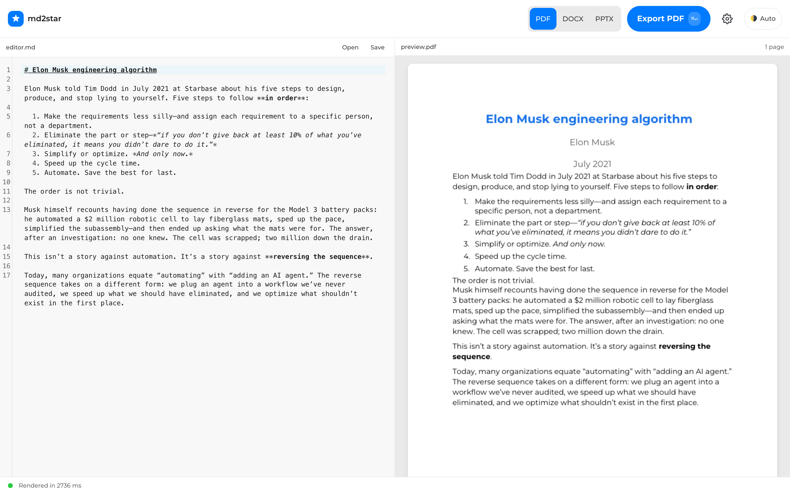
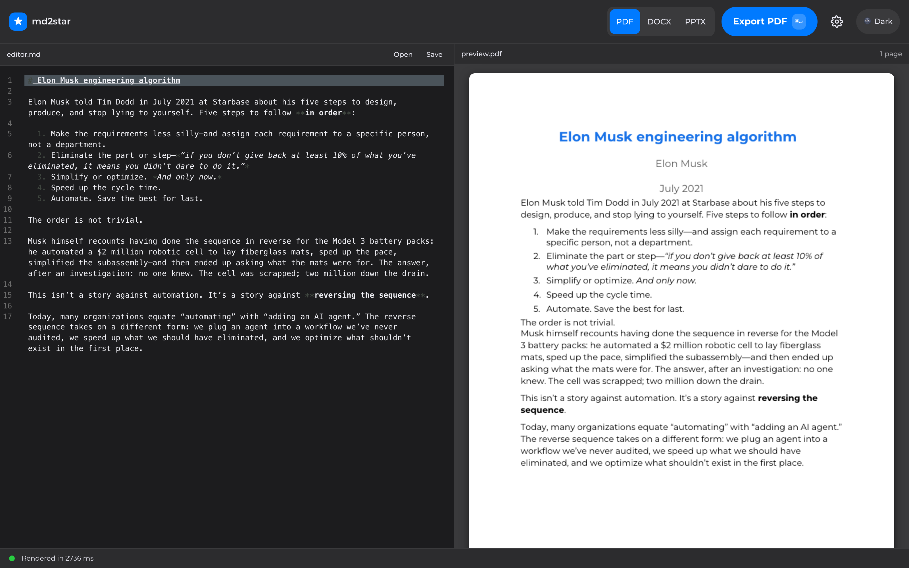

# md2star

[](https://pypi.org/project/md2star/)
[](https://github.com/warith-harchaoui/md2star/actions/workflows/ci.yml)


> 🇫🇷 *Version française : **[LISEZMOI.md](LISEZMOI.md)**.*

**Convert Markdown into professional DOCX, PPTX and PDF documents
using Pandoc, branded templates, and practical automation.**


`md2star` is a cross-platform command-line tool that wraps **Pandoc**
with a curated styling layer. It handles the parts Pandoc alone gets
wrong — list spacing, bibliography injection, LaTeX math, Mermaid
diagrams, image embedding, table widths, PPTX slide isolation — so
you stay in Markdown and never open Word to fix layout.

*DOCX mode — Musk's five-step engineering algorithm rendered live:*

| Light | Dark |
|---|---|
|  |  |

*PPTX mode — Kawasaki's 10/20/30 pitch deck rendered live:*

| Light | Dark |
|---|---|
|  |  |

*GUI mode — the local Overleaf-style editor with live PDF preview
(`md2star gui`):*

| Light | Dark |
|---|---|
|  |  |


## Why md2star?

Pandoc by itself is powerful but unopinionated: it gives you a
plain-vanilla DOCX with no template, no localized dates, no
sensible table widths, no Mermaid rendering. The result needs hand-
editing in Word before it's shareable.

`md2star` sits between you and Pandoc. You write Markdown; you get a
DOCX / PPTX / PDF that looks like a deliberate document.

Curious how it stacks up against Pandoc alone, Quarto, Marp, Typora,
Word itself, and other Markdown-to-document tools? See
**[LANDSCAPE.md](LANDSCAPE.md)** for the honest competitive comparison.

## Quick start

```bash
pipx install md2star          # one line, gets you the four CLIs + GUI
md2star doctor                # confirm the environment is healthy
md2docx report.md             # markdown → DOCX
md2pptx slides.md             # markdown → PPTX
md2pdf  paper.md              # markdown → PDF (needs LibreOffice)
md2star gui                   # local browser editor with live PDF preview
```

Prefer plain `pip`? Two `requirements` files mirror the install profiles:
`pip install -r requirements.txt` for the CLI, `pip install -r
requirements-gui.txt` for the CLI + GUI (same wheel — the GUI adds no
extra Python dependencies).

Prefer HTTP or MCP? md2star also ships a FastAPI surface and an MCP server:

```bash
pip install 'md2star[api,mcp]'

md2star-api                    # FastAPI: /health, /doctor, /convert — docs at /docs
curl -F 'file=@report.md' 'http://localhost:8000/convert?fmt=docx' -o report.docx

md2star-mcp                    # same tools (doctor / convert) over MCP
```

See **[docs/installation.md](docs/installation.md)** for the full
per-OS matrix (macOS / Ubuntu / Fedora / Arch / Windows), feature-
by-feature dependency table, verification recipe, and the
troubleshooting guide.

## Supported outputs

| Format | Status | Requires                            | CLI                          |
|--------|--------|-------------------------------------|------------------------------|
| DOCX   | Beta   | Pandoc                              | `md2docx file.md`            |
| PPTX   | Beta   | Pandoc                              | `md2pptx file.md`            |
| PDF    | Beta   | Pandoc + LibreOffice (`soffice`)    | `md2pdf  file.md`            |

"Beta" means: the format works for the common cases, has automated
test coverage, and has been used to ship real documents. The
table-render bug that haunted v1.x's PDF pipeline (cells leaking out
of the table as a vertical paragraph dump) is fixed in v2.0.0 — the
bundled template was rebuilt from a Pandoc-clean baseline.

## Examples (the punchy ones)

**1. Plain markdown → branded DOCX**

```bash
md2docx report.md --author "Ada Lovelace"
```

Gives you `report.docx` with the bundled template's fonts /
margins / heading styles, the first `# Heading` lifted to the
document title, today's date localized to the document language,
and the author rendered in the subtitle.

**2. Scientific paper with bibliography**

```bash
md2docx paper.md --author "Dr. Renegade Researcher" \
                 --bib references.bib \
                 --bibliography-name "References"
```

Pandoc's `citeproc` resolves `[@einstein1905]` references against the
BibTeX file and appends a "References" section at the end.

**3. PDF that matches the DOCX 1:1**

```bash
md2pdf paper.md --author "Dr. Renegade Researcher" --bib references.bib
```

Renders the DOCX through headless LibreOffice so the PDF inherits
every md2star polish — branded template, Mermaid PNGs, table
styles, localized dates.

A self-contained cookbook with more recipes lives at
**[EXAMPLES.md](EXAMPLES.md)**.

---

## Local GUI (`md2star gui`)

Prefer a browser to a terminal? `md2star gui` launches an
Overleaf-style local editor: Markdown on the left, a **live PDF
preview** on the right, and one-click DOCX / PPTX / PDF downloads.

```bash
pip install 'md2star[gui]'    # self-documenting "I want the GUI" install
md2star gui                   # opens http://127.0.0.1:8765 in your browser
md2star gui --port 9000       # pick a port (auto-falls-back if taken)
md2star gui --no-browser      # just print the URL, don't auto-open
```

> `md2star[gui]` resolves to the **same wheel** as plain `md2star` — the GUI is
> bundled and needs no extra Python packages, so `pip install md2star` already
> includes it. The `[gui]` form is just a clearer way to say "I'm here for the
> editor".

What it gives you:

- **Live PDF preview** rendered in-page with PDF.js — no round trip
  through Word or a PDF viewer.
- **Folder browser** confined to a single folder you open, so you can
  edit a whole project's `.md` files (open / read / save / create /
  delete) without leaving the page.
- **In-session reference template** — drag a `template.docx` /
  `template.pptx` in and this session brands its output with it.
- **Draft auto-save** to the cache dir, so a browser crash or a
  restart never loses your text.

It is **local-first and offline**: the server binds to `127.0.0.1`
only, the entire frontend (PDF.js, CodeMirror, Tailwind, fonts) is
vendored inside the package, and it fronts the exact same converter as
the CLI — no data ever leaves your machine. Since v2.6.0 the GUI ships
in the core wheel; there is nothing extra to install (the
`pip install 'md2star[gui]'` command is a self-documenting alias for the
same wheel, not a separate download).

---

## Features

- **Frictionless Conversion**: Write in Markdown with your favorite editor (`emacs`, `vim`, `Sublime Text`, `Obsidian`, …) and produce styled `.docx`, `.pptx`, and `.pdf` files.
- **Local GUI** (`md2star gui`): an offline, localhost-only browser editor with a live PDF preview, a root-confined folder browser, in-session template upload, and draft auto-save. Bundled in the core wheel — nothing extra to install. See [Local GUI](#local-gui-md2star-gui).
- **LaTeX Math Support**: Robust rendering of complex formulas in both documents and slides.
- **Mermaid Diagrams**: ` ```mermaid ` blocks are rendered locally to PNG via the official Mermaid CLI and embedded automatically (requires Node.js ≥16).
- **Intelligent Metadata**:
  - Automatic **Title Extraction** from your first `# Heading`.
  - Smart **Subtitle Injection** combining Author and localized Date.
  - **Language Detection** via `langdetect`: date formats ship for 10 languages (English, French, Spanish, German, Italian, Portuguese, Dutch, Russian, Japanese, Chinese), with translated weekday/month names in 7 (fr, es, de, it, pt, nl, ru).
- **Scientific-Ready**: Native **BibTeX** integration via Pandoc's `citeproc`, for documents with managed reference libraries.
- **Native Footnotes**: Markdown footnotes (`text[^1]` + `[^1]: …`) pass straight through Pandoc's `footnotes` extension to real Word footnotes — DOCX gets true bottom-of-page footnotes, PPTX collects them into per-slide notes. No special syntax, no preprocessing. See [EXAMPLES.md §10](EXAMPLES.md#10-footnotes).
- **Automatic Cleanups** (quiet quality-of-life): remote `http(s)://` images downloaded for embedding (opt-in), HTML `<table>` blocks converted to Pandoc pipe-tables, and standalone images split off PPTX slides that contain a table (Pandoc otherwise drops them).
- **Reversible by Design**: md2star's output is a *faithful, recoverable* rendering, not a one-way dead end. Read the DOCX back with Pandoc and your headings, `**bold**`/`*italic*`/`` `code` `` emphasis, tables, and lists come back intact; render all the way to PDF and read it back with [kreuzberg](https://github.com/Goldziher/kreuzberg) and the `md → docx → pdf → text` round-trip is the exact identity `g(f(x)) = x` for prose, bullet lists, multi-page docs, and footnotes (CI-enforced). Repeated conversions converge to a **stable fixed point** rather than drifting. See [Round-trip fidelity](#round-trip-fidelity).
- **Graceful Image Path Resolution**: URLs, absolute paths, and relative paths all "just work". Relative `` references resolve against the input file's directory — so `md2docx subdir/file.md` from any cwd still finds the image. No need to `cd` into the source folder first.
- **Zero-Config Branding**: drop a `template.docx` / `template.pptx` next to your Markdown and md2star will pick it up automatically as `--reference-doc`. If neither exists, md2star fetches the `deraison.ai` default template by default (since v2.5.0) and caches it; pass `--no-remote-templates` / `--offline` to use the bundled template instead.
- **Discoverable CLI**: every wrapper supports `--help` / `-h` and prints the md2star-specific flags followed by `pandoc --help`, so the full conversion surface is one command away. Try `md2docx --help`, `md2pptx --help`, or `md2star --help`.
- **Opt-in LLM Linter**: a local Ollama pass fixes syntax-level mistakes (broken image links, unclosed fences, malformed pipes) **before** Pandoc parses the file. **Off by default** so conversions stay deterministic; pass `--lint` to opt in. The wrapper then spawns `ollama serve` and `ollama pull`s the default model on demand — `gemma4:e2b-mlx` on macOS (Apple-Silicon-optimized MLX build) or `gemma4:e2b` on Linux/Windows. The pass works with **zero Python dependencies** (stdlib `urllib`); installing the optional `md2star[ai]` extra swaps in the official `ollama` client for a nicer API with no change in behaviour.
- **AI-Drafted Alt-Text**: with `--lint`, every empty `` reference gets a vision-model-drafted alt text (same `gemma4:e2b` model, cached per image). Override the model with `MD2STAR_ALT_TEXT_MODEL`.
- **Companion: AI Template Adapter**: when you need to brand a corporate
  PPTX template that doesn't follow Pandoc's standard layout names, use the
  sibling [md2star-adapt](https://github.com/warith-harchaoui/md2star-adapt)
  tool to build a compatible reference doc from the template + its PDF
  export.

---

## Installation

`md2star` is a Python package distributed on PyPI. Installation via
[pipx](https://pipx.pypa.io/) is recommended — it isolates the
package in its own venv and puts the four CLIs (`md2star`,
`md2docx`, `md2pptx`, `md2pdf`) on your PATH. Pandoc is the only
hard system dependency; LibreOffice is needed for `md2pdf`; Node.js
is needed for Mermaid; Ollama is needed for `--lint`.

- macOS 🍎 : `brew install pandoc pipx`
  (install `brew` thanks to [brew.sh](https://brew.sh/))

  ```bash
  pipx ensurepath          # one-time: add ~/.local/bin to PATH
  pipx install md2star

  # (install `brew` itself via https://brew.sh/)
  # Optional: PDF output needs LibreOffice
  brew install --cask libreoffice
  # Optional: Mermaid diagrams need Node.js
  brew install node
  # Optional: --lint and AI alt-text need Ollama
  brew install ollama
  # Optional: nicer AI transport (official ollama client) — pipx-friendly
  pipx inject md2star ollama      # equivalent to the md2star[ai] extra
  ```

- Ubuntu 🐧 : `sudo apt-get install pandoc pipx`

  ```bash
  pipx ensurepath
  pipx install md2star

  # Optional dependencies
  sudo apt-get install libreoffice nodejs
  curl -fsSL https://ollama.com/install.sh | sh   # ollama
  ```

- Windows 🪟 : `winget install --id JohnMacFarlane.Pandoc`

  ```powershell
  python -m pip install --user pipx
  python -m pipx ensurepath
  pipx install md2star

  # Optional dependencies
  winget install --id TheDocumentFoundation.LibreOffice
  winget install --id OpenJS.NodeJS
  winget install --id Ollama.Ollama
  ```

### Install from source (development path)

```bash
git clone https://github.com/warith-harchaoui/md2star.git
cd md2star
make install            # checks deps, runs `pipx install .`
```

Prefer plain `pip` into a venv? Two requirement files at the repo root
point straight at `pyproject.toml` (which stays the single source of
truth for version pins):

- `requirements.txt` — **runtime** (`-e .`: langdetect + Pillow), enough
  to run `md2docx` / `md2pptx` / `md2pdf`.
- `requirements-dev.txt` — **dev + test** (`-e .[dev]`: pytest, ruff,
  pytest-cov, pypdf, the api/mcp deps, and kreuzberg).

```bash
python -m venv .venv && source .venv/bin/activate
pip install -r requirements.txt        # runtime only
# or
pip install -r requirements-dev.txt    # runtime + test/lint stack
```

### Updating

| Platform | Command |
|----------|---------|
| Any (PyPI install) | `pipx upgrade md2star` |
| macOS / Linux from source | `make update` (git pull + `pipx install --force .`) |
| Windows from source | `powershell -ExecutionPolicy Bypass -File scripts\update.ps1` |

### For development

```bash
make dev                # creates .venv/ with `pip install -e .[dev]`
source .venv/bin/activate
python -m pytest tests/ -v
```

---

## Usage Guide

### 1. Simple Export
```bash
md2docx myfile.md
```
*Generates `myfile.docx`*.

### 2. Scientific Paper (with Citations and Math Formulas)
```bash
md2docx work.md --author "Dr. Renegade Researcher" --bib references.bib --bibliography-name "References" --lang en-US
```
*Generates `work.docx`*.


### 3. Presentation Slides
```bash
md2pptx slides.md --author "Speaker Name"
```
*Generates `slides.pptx`*.

### 4. Branded Slides with Custom Template
```bash
md2pptx slides.md --reference-doc my_branded_template.pptx
```

### 5. PDF Output
```bash
md2pdf paper.md --author "Dr. Renegade Researcher" --bib references.bib
```
*Generates `paper.pdf`* (via headless LibreOffice; requires `soffice` on PATH).

### 6. Opt-in LLM Syntax Lint

```bash
# default: lint is OFF, conversions are deterministic
md2docx draft.md

# opt in (spawns `ollama serve` and pulls the default model on demand)
md2docx draft.md --lint

# explicit no-op (same as the default; kept for unambiguous scripting)
md2docx draft.md --no-lint
```

When you pass `--lint`, a local Ollama pass (text-only `gemma4:e2b-mlx` on macOS, `gemma4:e2b` on Linux/Windows) fixes broken image links, unclosed code fences, and malformed table pipes before Pandoc sees the file. The same `--lint` flag also fills empty `` alt text via a local vision model (override the model with `MD2STAR_ALT_TEXT_MODEL`). The wrapper starts the daemon on demand (`ollama serve`) and pulls the default model on first use (`ollama pull gemma4:e2b…`) — a one-time download, narrated on stderr. If `--lint` is passed but Ollama isn't installed, md2star prints a one-line warning on stderr and falls back to the original Markdown so the conversion still succeeds.

The request reaches the daemon over stdlib `urllib` by default (no Python dependency). Install the optional `md2star[ai]` extra — `pip install 'md2star[ai]'`, or `pipx inject md2star ollama` for a pipx install — to route through the official `ollama` client instead. It is a pure transport upgrade: same models, same output, same fallback guarantees; the extra only buys the typed client API.

---

## Template Adapter (separate repo)

For branded PPTX templates whose layout names don't follow Pandoc's
defaults, use the companion tool
[md2star-adapt](https://github.com/warith-harchaoui/md2star-adapt). It runs
a three-phase pipeline — extract theme/logo/shapes from the PPTX, classify
each layout with a local VLM (Ollama) against the matching PDF, then
assemble a Pandoc-compatible reference doc — and produces a
`branded_ref.pptx` you feed back to md2star via `--reference-doc`.

It lives in its own repo because its dependencies (PyMuPDF, lxml,
python-pptx, requests + a running Ollama VLM) are much heavier than the
core conversion pipeline needs, and the correctness profile (VLM-driven)
is different in kind from md2star's deterministic core.

---

## Examples

A self-contained cookbook lives at **[EXAMPLES.md](EXAMPLES.md)** —
covering titles, Mermaid, lists, multi-column slides, LaTeX math,
bibliographies, branded templates, language detection, page breaks, and
[footnotes](EXAMPLES.md#10-footnotes).

You can also find more complex examples inside the [`tests/examples/`](tests/examples) directory. To natively batch-compile all documents inside the folder, execute the bash runner:
```bash
cd tests/examples
./run.sh
```

Below are basic `.docx` and `.pptx` files generated dynamically during our test suite from sample Markdown files:

**Word Documents Examples**
- Basic Title [assets/docx/basic.docx](assets/docx/basic.docx) *(from [basic.md](assets/docx/basic.md))*
  ```bash
  md2docx assets/docx/basic.md
  ```
- Author Injected [assets/docx/with_author.docx](assets/docx/with_author.docx) *(from [with_author.md](assets/docx/with_author.md))*
  ```bash
  md2docx assets/docx/with_author.md --author "Tester"
  ```
- Bibliography [assets/docx/with_bib.docx](assets/docx/with_bib.docx) *(from [with_bib.md](assets/docx/with_bib.md))*
  ```bash
  md2docx assets/docx/with_bib.md --bib "assets/references.bib" --bibliography-name "References"
  ```
- Language & Date (French) [assets/docx/with_lang.docx](assets/docx/with_lang.docx) *(from [with_lang.md](assets/docx/with_lang.md))*
  ```bash
  md2docx assets/docx/with_lang.md --author "User"
  ```
- Math Formulas [assets/docx/math.docx](assets/docx/math.docx) *(from [math.md](assets/docx/math.md))*
  ```bash
  md2docx assets/docx/math.md
  ```

**PowerPoint Slides Examples**
- Extensive Example [assets/pptx/example.pptx](assets/pptx/example.pptx) *(from [example.md](assets/pptx/example.md))*
  ```bash
  md2pptx assets/pptx/example.md
  ```
- Branded Template [tests/examples/branded_slides.pptx](tests/examples/branded_slides.pptx) *(from [branded_slides.md](tests/examples/branded_slides.md) + [Presentation1.pptx](tests/examples/Presentation1.pptx))*
  ```bash
  md2pptx tests/examples/branded_slides.md --reference-doc tests/examples/Presentation1.pptx
  ```

---

## Quality & Reliability


`md2star` is built for reliability. Our automated test suite covers:
- [x] **Metadata accuracy**: title extraction, author injection, and subtitle composition.
- [x] **Bibliography rendering**: citeproc pipeline against the curated [references.bib](assets/references.bib) snapshot.
- [x] **Date localization**: French weekday/month rendering and date-format injection.
- [x] **Preprocessor invariants**: list spacing, code-block preservation, HTML-table conversion, pipe-table separator normalization, image width injection, language detection, mermaid fallback, math-in-code unwrapping, PPTX slide isolation.
- [x] **Offline-mode enforcement**: every network-touching phase refuses to run with `--offline`.

### Integration tests (shell)

Requires **Pandoc** installed:
```bash
make test
```

### Unit tests (Python)

Requires **pytest** and your generated virtual environment:
```bash
python -m pytest tests/ -v
```

For more details, see [tests/README.md](tests/README.md).

---

## Round-trip fidelity

Converting to `.docx` doesn't trap your content in a binary format. md2star's
output is a **faithful, reversible rendering** of your Markdown: read the
`.docx` back with any DOCX reader and the source content comes home.

**What survives `md → docx → md`:**

| Construct                       | Recovered? |
|---------------------------------|:----------:|
| Headings (section levels)       | ✅ |
| `**bold**` / `*italic*`         | ✅ |
| Inline `` `code` `` spans       | ✅ (via Pandoc) |
| Pipe tables (every cell)        | ✅ |
| Bullet & numbered lists         | ✅ |
| Paragraph text                  | ✅ |

**It reaches a fixed point.** The round-trip is idempotent in the
mathematical sense — running it twice yields the same document as running it
once (`g(g(x)) == g(x)`), so repeated conversions *converge* instead of
accumulating cruft. This is enforced in CI by
[`tests/test_roundtrip.py`](tests/test_roundtrip.py), which converts a fixture
to DOCX, reads it back with Pandoc's native reader, and asserts both content
survival and the fixed-point property.

The one thing md2star *adds* on each run — by design — is a localized **date
subtitle** re-stamped with today's date; that (and cosmetic details like line
wrapping and the exact dash count in a table separator, which carry no
meaning) is normalized out before the idempotence check. Nothing else drifts.

**Reproduce it yourself** (any DOCX reader works; the built-in Pandoc path
needs no extra install):

```bash
md2docx report.md --offline            # report.md → report.docx
pandoc report.docx -t gfm --wrap=none  # report.docx → Markdown on stdout
```

**The `pdf → md` direction is exact too — and CI-enforced.** Rendered all the way
to a PDF and read back with [kreuzberg](https://github.com/Goldziher/kreuzberg)
(`extract_file_sync(path, config=ExtractionConfig(output_format=OutputFormat.PLAIN))`),
the round-trip `md → docx → pdf → text` is the **identity** `g(f(x)) = x` — proven
by exact, whole-document string equality under an explicit *normal form* in
[`tests/test_roundtrip_ocr.py`](tests/test_roundtrip_ocr.py), run for real in CI on a
full LibreOffice + kreuzberg toolchain. It holds for:

- **paragraphs** of any length (line wrapping is reflowed back);
- **bullet lists**;
- **multi-page** documents (page-number footers are normalized out);
- **footnotes** — numeric `[^1]` and named `[^aa]` alike: the footnote *text* is
  recovered even though the renderer renumbers the label.

What a PDF *cannot* give back is markup it never stored: inline emphasis, heading
*levels*, and table structure render to plain text — their words survive, their
markup does not. That structured markup is exactly what the DOCX reader above
recovers, so the two directions together cover the whole document.

---

## Customization

### Metadata Defaults
Adjust your global defaults in `md2star/data/metadata.yaml`:
```yaml
author: "Your Default Name"
date_format: "%A, %e %B %Y"
lang: "en-US"
```

Chosen conventions:

  + `date_format` uses an `strftime()`-style format string.
See [C/POSIX date-time formatting documentation](https://pubs.opengroup.org/onlinepubs/9699919799/functions/strftime.html) for more information.

  + `lang` uses a BCP 47 language tag (e.g., `en-US`, `fr-FR`).
See [RFC 5646 documentation](https://datatracker.ietf.org/doc/html/rfc5646) for more information.

### Styling Templates

Two levels of customization, from project-local to global:

**Per-project** (recommended): drop a `template.docx` or `template.pptx` next to your Markdown file. Every md2star wrapper auto-detects it and passes it as `--reference-doc`. Commit it alongside your source so collaborators and CI produce identical branded output.

If neither `template.docx` (preferred) nor the legacy `.pandoc-reference.docx` (still honored with a deprecation notice) exists, md2star fetches the default `deraison.ai` template **by default** (since v2.5.0) and caches it under XDG:

```
https://deraison.ai/template.docx
https://deraison.ai/template.pptx
```

Pass `--no-remote-templates` (or the hard `--offline` switch) to skip that fetch and use the bundled template shipped inside the wheel. A failed download (no network, 404, timeout) also falls back to the bundled template, so a conversion never breaks just because `deraison.ai` is unreachable. You then edit the local/cached copy in Word / PowerPoint / LibreOffice and commit it whenever you're happy with the styling.

**Global** (changes the bundled default for every project that hasn't pinned its own): modify the master templates in `md2star/data/` to change fonts, margins, or logos:
- `md2star/data/template.docx`
- `md2star/data/template.pptx`

These are shipped inside the wheel and used as the offline fallback when no
`template.{docx,pptx}` is found next to your Markdown. After editing, run
`make reinstall` so the changes take effect for already-installed CLIs.

---

## Developer Documentation

For contributors and advanced users interested in the inner workings of our Python logic and AST parsing hooks, check our internal API guides:
- [Developer Guide](docs/developer_guide.md)

---

## Related Projects

- **[Pandoc](https://pandoc.org/)**: The engine that makes document conversion universal.
- **[MarkItDown](https://github.com/microsoft/markitdown)**: A utility by Microsoft that performs the reverse operation, converting Office documents and other formats *into* Markdown.
- **[Obsidian](https://obsidian.md/)**: Our recommended environment for writing high-fidelity Markdown.
- **[Zotero](https://www.zotero.org/)**: The ideal research companion for managing your `.bib` bibliographies.

---

## Troubleshooting

| Issue | Solution |
|------|----------|
| `md2docx: command not found` | Add `~/.local/bin` to your PATH (`pipx ensurepath`) and restart your shell. |
| `pandoc: command not found` | Install [Pandoc](https://pandoc.org/installing.html). |
| `mmdc` errors / mermaid blocks left as code | Install Node.js ≥16 so `npx` can fetch `@mermaid-js/mermaid-cli`. |
| Want the LLM linter to run | Pass `--lint`. It is off by default; with `--lint`, the wrapper starts the Ollama daemon and pulls the model on demand. Requires `ollama` on `PATH`; otherwise it silently no-ops. |
| `--lint` printed a model-pull error | The first run downloads `gemma4:e2b-mlx` (macOS) or `gemma4:e2b` (Linux/Windows). If the pull failed (e.g. offline), md2star falls back to the original Markdown silently — fix your network and re-run. |
| `md2pdf: LibreOffice not found` | Install LibreOffice (`brew install --cask libreoffice` / `apt-get install libreoffice` / winget). |
| PPTX template layout warnings | Normal if a template lacks standard slide-layout names; output is still valid. |
| Remote image not embedded | Pass `--allow-remote-images` to opt into the download (md2star is offline-by-default). |

---

## Security model & offline mode

No `.md` file you process can make a network call on its own. Remote
images stay opt-in via `--allow-remote-images`. Since v2.5.0 the
`deraison.ai` reference template is fetched by default when no local
`template.{docx,pptx}` exists (cached under XDG, bundled fallback on
failure); use `--no-remote-templates` to skip it. The `--offline`
switch is the hard kill-switch that forbids every network touch and
makes the refusal explicit in scripts. Full security model:
**[SECURITY.md](SECURITY.md)**.

## Roadmap & status

- See **[ROADMAP.md](ROADMAP.md)** for what's coming and what's
  explicitly NOT in scope.
- See **[CHANGELOG.md](CHANGELOG.md)** for the per-release diff.
- See **[docs/audit.md](docs/audit.md)** for the latest honest
  engineering audit (forces, risks, priorities).

## Contributing

See **[CONTRIBUTING.md](CONTRIBUTING.md)** for the quickstart,
project layout, and PR checklist. The TL;DR is `make dev` +
`python -m pytest tests/` + `ruff check md2star/ tests/`.

---

## License

Distributed under the **[BSD 3-Clause License](LICENSE)** — the same
permissive license used by scikit-learn and other major scientific
Python projects.

**Author:** [Warith HARCHAOUI](https://www.linkedin.com/in/warith-harchaoui/)
