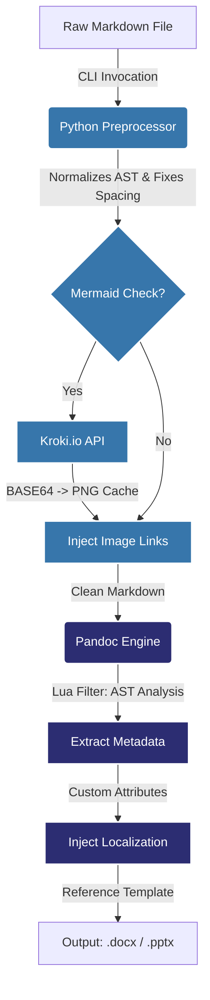

# md2star Developer Guide 🛠️⭐️

Welcome to the **md2star** engineering documentation! This guide centralizes everything you need to know about extending or fixing the underlying pipeline of the project.

> [!TIP]
> This repository is built globally around strict **Unix Philosophy**: do one thing dynamically, efficiently, and pass it elegantly. The single executable wrappers (`md2docx` and `md2pptx`) pipe data chronologically through discrete layers.

---

## 🏗️ Conversion Architecture

To understand how your raw Markdown gets translated so cleanly into Microsoft Office standard documents, refer to our system workflow:



---

## 🐍 1. Python Preprocessing Engine

**Path:** [`scripts/preprocessing.py`](../scripts/preprocessing.py)

Before Pandoc ever touches the file, our `preprocessing.py` script acts as a highly specialized formatter.

### What it solves
1. **The "Attached List" Problem**: Users naturally type bullet lists immediately after paragraphs without `\n\n` double spacing. By default, Pandoc treats these as inline spans. The script tokenizes prefix markers (`-`, `+`, `1.`, `*`) and forces proper document spacing.
2. **Dynamic Diagramming**: If the script detects ```mermaid``` fences, it intercepts them, pushes them to the open-source Kroki engine, and silently constructs high-fidelity `.png` local caches, replacing the block syntax with standard images.

> [!NOTE]
> All preprocessing operations are cached via `MD5` hashing. Diagrams are NEVER re-downloaded unless their source characters change!

---

## 🌙 2. Lua Filtering (Pandoc AST Hook)

**Path:** [`pandoc/filters/md2star.lua`](../pandoc/filters/md2star.lua)

Our custom `.lua` filter intercepts the Pandoc **Abstract Syntax Tree (AST)** right before mapping it to the `.docx` template layout XML files.

### Key Operations
- **Title Extraction**: Automatically steals the very first `# H1 Heading` inside your document and securely pushes it to the system metadata headers.
- **Subtitle Construction**: Detects author parameters locally and couples them with dynamic Unix date formatting injected dynamically under the exact `Subtitle` layout style wrapper.
- **C-Level Date Localization**: Uses strict POSIX representations mapping system variables (e.g. `fr-FR` generating `"avril"` instead of `"April"`).

> [!WARNING]
> Lua operations natively modify the document structure. Avoid stripping ID tags or identifiers carelessly as it might break complex Table of Content generation if modified wrong.

---

## 🧪 Testing Framework

We rely heavily on Python `pytest` for unit testing the preprocessor, and `make test` (which triggers `scripts/test.sh`) to integration-test the whole bridge architecture from bash to output. 

> [!IMPORTANT]
> If you make any modifications to `preprocessing.py` or `.lua` files, absolutely ensure you run `make test`. The shell script will unzip the OOXML structures of generated `docx` and `pptx` dumps and binary-search inside `document.xml` to ensure rendering formats weren't destroyed!
