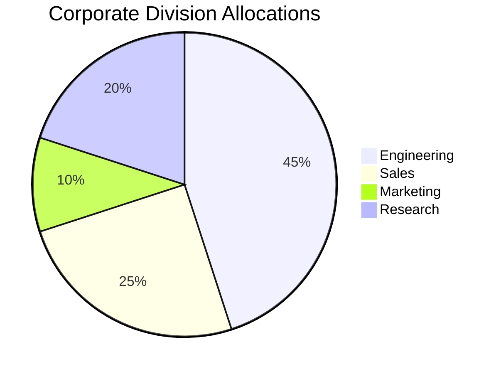

# Executive Summary Slide

## An Author Injected Dynamically 

<!--
Speaker notes can be injected natively into Microsoft PPTX by simply using standard HTML comment blocks inside the markdown source! This is an enormous advantage for presenters writing quick outlines.
-->

***

# Presentation Modularity 

Using three consecutive asterisks (`***`) instantly partitions your content into entirely new slides, letting you fluidly compose long frameworks. 

You can map text as normal:
- Discover structural endpoints
- Evaluate **emphasized** key metrics
- Format `inline code triggers`

***

# Deep Media Integrations {.big}

## Using structural image calls

You can quickly dump visual parameters safely into the PPTX slide array.

{width=85%}

***

# Dynamic Layouts 

Our framework allows columned mappings to cleanly generate structural alignments in MS Office dynamically.

This is the *left* column. It can contain paragraph analysis detailing structural constraints locally without breaking the boundaries.

{.column}

This is the *right* column. Directly coupled natively.

***

# Mermaid & Mathematical Integration

***

# Citations Support

Research slides map cleanly utilizing `--bib`. According to researchers [@causality-pearl], complex theoretical frameworks can be seamlessly embedded into Microsoft workflows.

$$
E = mc^2
$$

and

$$
\exp(i \times \pi)+1 = 0
$$