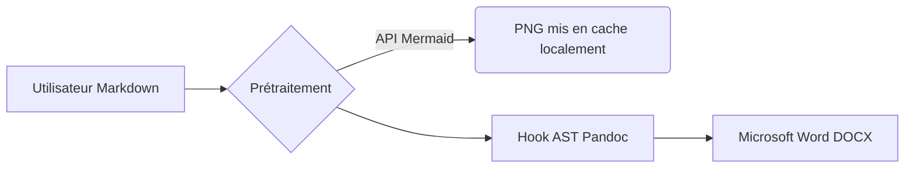

# Guide complet du document

## Introduction
Ce document démontre toutes les capacités du pipeline **md2star** pour générer des artefacts `.docx`.

L’extraction du titre a automatiquement supprimé l’en-tête `# Guide complet du document` ci-dessus et l’a converti en métadonnée littérale de titre du document. Des sous-titres contenant l’auteur et la date ont également été injectés dynamiquement juste en dessous à l’aide de scripts Lua.

## 1. Mise en forme et alignement des listes
Les utilisateurs construisent souvent par accident des listes Markdown trop serrées, « collées ». Notre préprocesseur Python les développe mathématiquement en listes aérées et sûres afin que Pandoc affiche correctement les puces dans le document.

Une liste non ordonnée standard représentant des secteurs d’entreprise:
- Technologies de l’information
- Ventes et marketing
- Recherche et développement

Une liste de travail ordonnée:
1. Initialiser l’objectif cible.
2. Rédiger le protocole de recherche.
3. Valider les métriques.

## 2. Rendu des diagrammes Mermaid
En utilisant Kroki, nous pouvons intégrer en toute sécurité des diagrammes d’architecture système directement dans les documents sans casser Pandoc:

## 3. Formules mathématiques
Les équations écrites en LaTeX sont bien interprétées par le moteur d’équations natif de Microsoft Office:

$$
e^{i \times \pi}+1 = 0
$$

et

$$
f(x) = \int_{-\infty}^{\infty} \hat{f}(\xi)\,e^{2 \pi i \xi x} \,d\xi
$$

## 4. Médias riches et tableaux
Vous pouvez intégrer des tableaux de manière fluide et sécurisée pour représenter des données:

| Architecture du modèle | Nombre de paramètres | Année de sortie |
|------------------------|----------------------|------------------|
| GPT-4                  | Non divulgué         | 2023             |
| Llama 3                | 70 milliards         | 2024             |
| Poids ouverts          | 8 milliards          | 2024             |

Vous pouvez également intégrer des images standard via des URL:

## 5. Citations professionnelles
Lors de la compilation avec `--bib references.bib --bibliography-name "Références"`, des références natives comme [@causality-pearl] seront automatiquement évaluées, analysées via `citeproc`, puis élégamment structurées dans le document de sortie.
