# Des outils pour sev7n

## Suite AI Helpers · md2star · text2SQL · moteur d'intention

Une démonstration en trois temps, de l'outil qu'on intègre lundi, à la méthode qu'on transmet.

<!--
Slide de titre. Message d'ouverture :
« Deux choses en même temps : des OUTILS intégrables vite et une MÉTHODE de raisonnement sur l'IA appliquée. Tout tourne en local. »
90 min, 3 démos live, backup slides à la fin. Vocabulaire : je définis chaque terme, arrêtez-moi.
-->

***
# « L'art naît de contraintes, vit de luttes et meurt de liberté » {.big}

attribué à André Gide

<!--
Ouverture, le ton. La contrainte, local-first, Markdown, souveraineté, pas de cloud,
est précisément ce qui force la qualité et la créativité dans tout ce qui suit. Fil du talk.
-->
***
# La citation, décomposée

« L'art naît de contraintes, vit de luttes et meurt de liberté. »

- 🎨 Naît de contraintes : productivité (entreprises en concurrence) · souveraineté · écofrugalité
- ⚔️ Vit de luttes : notre travail contre l'aliénation, pour l'épanouissement des humains : toute la noblesse de notre mission
- 🕊️ Meurt de liberté : l'épanouissement du travail accompli : on le transmet, pour en appeler un prochain

<!--
Décomposition des 3 mouvements de Gide, selon l'interprétation de l'auteur :
1. Contraintes = souveraineté (RGPD), partage (BSD-3, on démonte pour apprendre), écofrugalité (petits modèles locaux).
2. Luttes = le travail d'ingénierie honnête, dans sa noblesse.
3. Liberté = l'épanouissement : transmettre le travail accompli (= ce talk même) pour en attendre un prochain.
C'est le pont vers la pédagogie : transmettre est le sens de toute la présentation.
-->
***

# 👋 D'où je parle

- Je conçois des outils d'IA appliquée : pragmatiques, souverains.
- Tous open source, tous pensés pour tourner sur votre machine.
- Aujourd'hui : trois d'entre eux, choisis parce qu'ils touchent vos métiers.

> Le but n'est pas de vous éblouir, mais que vous repartiez en sachant quoi faire *lundi matin* avec une IA outillée en production.

<!--
Poser qui parle et l'intention. Ton : humble, opérationnel. deraison.ai en arrière-plan.
Insister : je vais être pédagogue, définir chaque mot technique.
-->

***

# ♻️ Ce deck s'est compilé tout seul

Ce que vous regardez a été écrit en texte, puis transformé en PowerPoint et en PDF par `md2star`, un outil de la Partie 1.

> 🔧 La démo, c'est le medium : je mange ma propre cuisine. L'outil que je vous présente a fabriqué la présentation qui vous le présente.

<!--
Méta-moment. « Je n'ai pas ouvert PowerPoint. J'ai écrit du texte, une commande l'a mis en forme. »
Commandes réelles : md2pptx presentation.md --reference-doc template.pptx ; puis soffice → PDF.
-->

***

# Deux promesses pour ces 90 minutes {.big}

1. La pédagogie : vous comprendrez comment ça marche, pas juste que ça marche.

2. L'opérationnel : repartir avec des outils branchables dans vos métiers.

<!--
Les deux signatures voulues. On y reviendra à la fin. C'est le contrat avec la salle.
-->

***

# La leçon, en une phrase {.big}

Changez une seule variable à la fois, mesurez honnêtement et laissez le public lire la différence, au lieu de la lui asséner.

<!--
LE fil rouge. Les trois projets racontent cette idée sous trois angles. À répéter en clôture.
-->

***
# Richard Feynman

:::::: columns
::: column

:::
::: column
*« Si vous ne pouvez pas l'expliquer simplement, c'est que vous ne le comprenez pas assez bien. »*

attribué à Richard Feynman
:::
::::::

<!-- Feynman : comprendre assez pour simplifier. Colonnes portrait/citation. -->
***
# 🗺️ Le menu

- Introduction · AI Helpers
- Partie 1 · md2star & front
- Partie 2 · text2SQL
- Partie 3 · moteur d'intention
- Conclusion · la production

<!-- Deux fils : la pédagogie et l'opérationnel dans vos métiers. -->
***

# Introduction · AI Helpers {.big}

## Une suite d'outils, pas un outil

<!-- Section divider. -->

***

# 🧩 C'est quoi une « bibliothèque » ?

Un bloc de code réutilisable qui fait un travail précis, qu'on « branche » dans son projet au lieu de le réécrire.

- On l'installe en une commande (`pip install …`)
- Analogie : une brique Lego avec des connecteurs standard

> Une *suite* de bibliothèques = une boîte de Lego assortis.

<!--
Pour les non-devs. pip = le magasin de briques Python (PyPI). Chaque helper = une brique.
-->

***

# 📦 AI Helpers, c'est quoi

Un méta-paquet Python : une collection de 11 bibliothèques focalisées pour l'IA et le média.

- Chaque brique fait une chose, bien
- Les briques se composent
- Local-first : tout tourne sur votre machine
- Open source (licence BSD-3, comme scikit-learn)

<!--
On installe le coin dont on a besoin, pas tout. Philosophie Unix : petits outils composables.
-->

***

# 🌍 La suite, en ligne

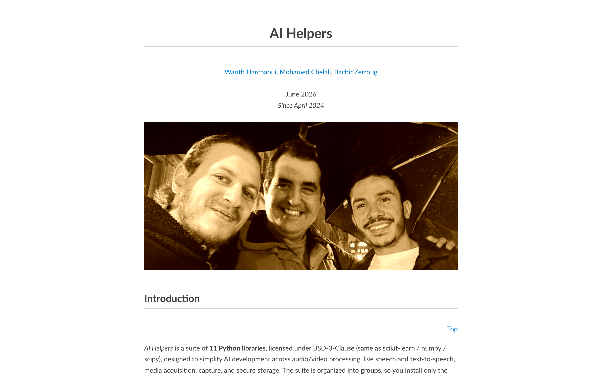

<!-- harchaoui.org/warith/ai-helpers, la landing publique. Sur la photo : moi, Mohamed Chelali, Bachir Zerroug. Montre que c'est un vrai projet documenté, pas un prototype. -->

***

# 🗂️ La carte des 11 helpers

| Groupe | Helpers |
|---|---|
| 🧱 Core | `os-helper` |
| 🔊 Audio & voix | `audio-helper` · `vocal-helper` · `speaker-helper` |
| 🎬 Vidéo & capture | `video-helper` · `capture-helper` |
| 🌐 Acquisition | `youtube-helper` · `podcast-helper` |
| 🗄️ Stockage | `bucket-helper` (S3) · `sftp-helper` |
| 📄 Documents | `md2star` |

<!-- os-helper = la fondation commune. Détail de chaque helper : backup slides (dont vocal-helper). -->

***

# 🧩 C'est quoi « local-first » ?

Vos données sont traitées sur votre ordinateur, pas envoyées à un service distant.

| Cloud (habituel) | Local-first (ici) |
|---|---|
| vos données partent chez un tiers | elles ne quittent pas la machine |
| compte, clé d'API, facture | rien de tout ça |
| « faites-nous confiance » | vérifiable (moniteur réseau) |

<!--
Point fondateur de toute la présentation. Local-first = souveraineté. On le reverra pour le RGPD.
-->

***

# 🤞 La Promesse, honnêtement

Trois niveaux, sans mentir :

- ✅ Garanti local : os / audio / video / vocal / md2star : rien ne sort.
- 🌐 Ne prend que ce que vous demandez : youtube / podcast lisent la source, sans rien uploader sur vous.
- ⚠️ Pas local, assumé : bucket / sftp déplacent vos données là où vous choisissez.

> L’honnêteté sur les limites rend la promesse crédible.

<!-- On ne prétend pas que TOUT est local. On dit exactement où ça tient. -->

***

# 🧩 C'est quoi « composable » ?

Des outils conçus pour se brancher les uns aux autres, la sortie de l'un devenant l'entrée du suivant.

- Analogie : les tuyaux Unix ou une chaîne de production
- Chaque étage reste simple ; la puissance vient de la chaîne

<!-- Prépare l'exemple composé suivant. -->

***

# 🧱 Les briques se composent

Un talk YouTube → un document Word + PDF, chaque étape un helper :

```
youtube-helper → audio-helper → vocal-helper → md2star
  (télécharger)   (décoder)      (transcrire)   (mettre en forme)
```

> 🔧 Ce ne sont pas des jouets, ce sont des `pip install` qu'on enchaîne.

<!-- Exemple réel : télécharger l'audio, transcrire en local (Whisper), écrire un .md, md2docx/md2pdf. Zéro cloud. Transition vers md2star. -->

***

# Partie 1 · écrire du texte et du code avec md2star & front {.big}

## Générer des documents + des graphiques

(la priorité « intégrable dès maintenant »)

<!-- Section divider. Le CTO veut intégrer AU MOINS génération documentaire + restitution graphique. C'est ici. -->

***

# 🧩 C'est quoi « Markdown » ?

Une façon d'écrire du texte mis en forme avec des signes simples, lisible tel quel.

```markdown
# Un titre
Du texte en gras, en italique.
- une puce
- une autre
```

> On écrit dans un éditeur de texte, pas dans Word. Versionnable dans git.

<!--
Markdown = le format source de TOUT ce que je montre (ce deck, les bases de connaissance, les rapports).
Montrer que c'est trivial à lire.
-->

***

# Markdown : la nourriture gourmet des LLM

J'ai un faible assumé pour le Markdown. Pour une raison précise : c'est le format que les LLM digèrent le mieux.

- du texte pur, mais structuré (titres, listes, tableaux)
- lisible par un humain et par une machine, sans conversion
- il se découpe proprement en tokens, zéro bruit binaire

> Word cache la structure dans du binaire ; le Markdown est la structure. Un LLM y voit clair.

<!--
Le Markdown est la langue commune entre humains et LLM. TOUT ce que je construis l'utilise comme
source : ce deck, la base de connaissance de la Partie 3, les rapports de notes-helper.
« Nourriture de fin gourmet pour les LLM » = un modèle lit du Markdown sans effort, la structure lui est offerte.
-->

***

# Mention spéciale : Obsidian

Mon éditeur Markdown de cœur, une base de connaissance locale faite de notes liées.

- local-first : vos notes sont de simples fichiers `.md` sur votre disque
- des liens entre notes → un cerveau numérique navigable
- aucun cloud imposé, aucun enfermement

> Écrire sa connaissance en Markdown, c'est déjà la préparer pour l'IA.

<!--
Obsidian = l'environnement d'écriture recommandé (cité par le README de md2star). Local-first, notes liées,
vos données restent à vous. Pont direct vers l'idée « le savoir vit en Markdown » de la Partie 3.
-->

***

# 🧩 C'est quoi « Pandoc » ?

Le couteau suisse de la conversion de documents : il transforme (presque) n'importe quel format en (presque) n'importe quel autre.

- Markdown → Word, PDF, HTML, LaTeX…
- Puissant, gratuit, universel
- … mais brut, sans opinion sur le style

> `md2star`, c'est *ma* sur-couche perso au-dessus de Pandoc : des années de réglages encapsulés pour que ça sorte propre du premier coup.

<!-- Pandoc est le moteur SOUS md2star. md2star = mon wrapper opinionated : goût, marque, corrections, du premier coup. -->

***

# Le problème : Pandoc tout nu

Brut, Pandoc donne :

- un Word sans template, sans marges pensées
- des dates non traduites, des tableaux déformés
- pas de diagrammes, pas de bibliographie propre

→ Il faut rouvrir Word pour réparer. Chaque fois.

<!-- La douleur concrète que md2star supprime. -->

***

# ✨ md2star se met entre vous et Pandoc

Vous écrivez du Markdown. Vous obtenez un Word / PowerPoint / PDF qui a l'air délibéré.

```bash
md2docx  rapport.md     # → Word
md2pptx  slides.md      # → PowerPoint
md2pdf   papier.md      # → PDF
```

md2star corrige ce que Pandoc rate : listes, bibliographie, formules, diagrammes, tableaux, slides.

<!-- Le pitch central. Vous restez dans du texte versionnable, jamais dans un binaire à réparer à la main. -->

***

# Un seul fichier `.md` → Word, PowerPoint ET PDF

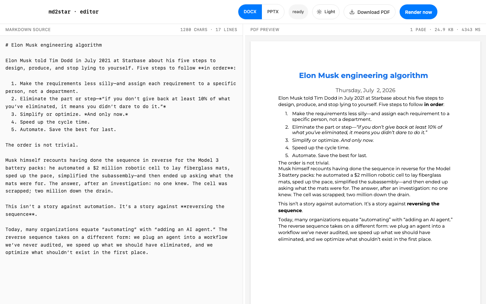{height=4.7in}

<!--
Légende (à dire) : Le même `.md` produit Word, PowerPoint et PDF, cohérents, ici le rendu Word brandé (template `deraison.ai`).
Mode DOCX = algorithme d'ingénierie en 5 étapes de Musk. Mode PPTX = pitch 10/20/30 de Kawasaki. On peut montrer le mode sombre + PPTX depuis ~/md2star/assets/.
-->
***

# 🖥️ La GUI locale, style Overleaf

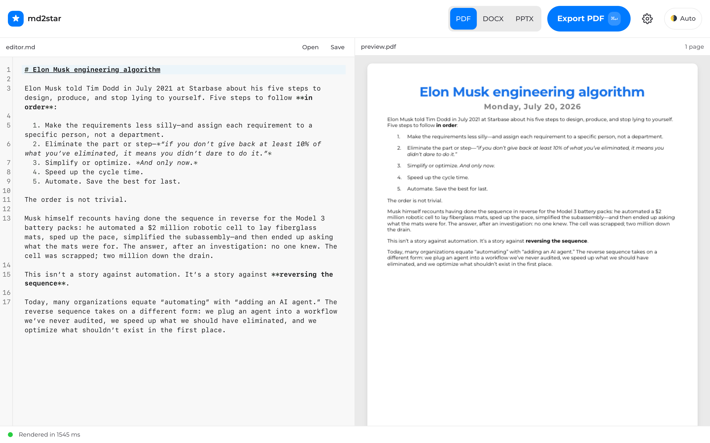{height=4.7in}

<!--
Légende (à dire) : Texte à gauche, aperçu PDF en direct à droite. `md2star gui`, 100 % hors-ligne.
DÉMO LIVE possible : md2star gui, taper du texte, voir le PDF se mettre à jour. Pas besoin d'Ollama. Capture faite aujourd'hui en headless.
-->
***

# 🚪 5 surfaces pour chaque outil

- 🖥️ 4 commandes : `md2docx` / `md2pptx` / `md2pdf` / `md2star`
- 🌐 GUI locale (aperçu PDF live)
- 🔌 API web (FastAPI)
- 🤖 Serveur MCP : un agent IA pilote la conversion
- 🧩 Skill Claude / OpenCode

> 🔧 Une même tuyauterie, cinq façons d'y entrer. Vous choisissez la porte.

<!-- Point opérationnel majeur : md2star n'est pas qu'un CLI. API HTTP + MCP = intégrable dans un backend / des agents. -->

***

# 🧩 C'est quoi une « API » ? un « MCP » ?

- API = une prise standard pour qu'un logiciel parle à un autre (ici : « convertis ce fichier », par le réseau).
- MCP = une prise pensée pour les agents IA : un assistant peut appeler l'outil tout seul.

> Traduction métier : md2star se branche dans vos applis et dans vos assistants.

<!-- API/MCP démystifiés pour les non-techs. MCP = Model Context Protocol, le « USB des outils pour IA ». -->

***

# 🔧 Intégration : concrètement, lundi

```bash
pipx install md2star   # installer
md2star doctor         # vérifier
md2docx rapport.md     # 1re conversion
```

- Une seule dépendance dure : Pandoc (+ LibreOffice pour le PDF)
- Licence BSD-3 : usage commercial libre, embarquable
- API : `pip install 'md2star[api,mcp]'`

<!-- Réponse directe à « quels outils je peux industrialiser ? » : celui-ci, tout de suite, sans friction juridique. -->

***

# 🧩 C'est quoi « idempotent » ?

Un aller-retour qui ne perd rien : le texte retraduit redonne l'original.

- Traduction FR→EN→FR : souvent ça dérive.
- Ici : Markdown → Word → Markdown revient identique.

> En maths : `g(f(x)) = x`. Le document n'est pas une impasse.

<!-- Prépare le clou technique. Analogie de la traduction aller-retour, parlante pour tous. -->

***

# 📌 Le clou technique : l'idempotence

md2star ne vous enferme pas dans un binaire.

- `Word → Markdown` : titres, gras, tableaux, listes reviennent intacts
- `Markdown → PDF → texte` : c'est l'identité

> Et c'est prouvé automatiquement à chaque modification du code (tests en CI).

<!-- LE point qui impressionne les techs : l'idempotence est TESTÉE (kreuzberg pour le PDF), pas revendiquée. Point fixe : pas de dérive à répétition. Ingénierie honnête et vérifiable. -->

***
# « Mermaid » : un diagramme écrit en texte

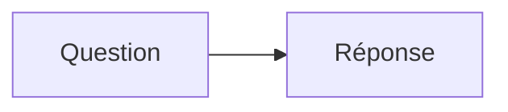
```mermaid
flowchart LR
  A[Question] --> B[Réponse]
```

<!-- Ce texte (flowchart LR, A vers B) rend l'image ci-dessus. Tout le Mermaid du deck est rendu en image par md2star. -->
***

# 🧩 C'est quoi « un LLM » ? « Ollama » ?

- LLM (Large Language Model) = un modèle entraîné sur énormément de texte, qui prédit la suite, donc peut écrire, résumer, coder.
- Ollama = un logiciel pour faire tourner un LLM sur votre machine, gratuitement, sans cloud.

> Tous mes projets utilisent des LLM via Ollama, en local. Zéro donnée envoyée dehors.

<!-- Définition CENTRALE, réutilisée en Partie 2 et 3. Insister : local = souverain + gratuit + hors-ligne. -->

***

# 🩹 Un confort malin : le correcteur LLM

`--lint` : un LLM local répare la syntaxe (liens cassés, blocs mal fermés) avant la conversion, et rédige la description des images.

> Éteint par défaut → conversions déterministes. On n'ajoute de l'IA que si on le demande.

<!-- gemma en local, zéro dépendance Python (urllib). Fallback silencieux si Ollama absent. -->

***

# 🎨 Des templates sans configuration

Posez `template.docx` / `template.pptx` à côté de votre fichier → repris automatiquement.

- Le branding d'équipe, versionné dans git
- Collègues + serveur de build → rendu identique

> Ce deck utilise justement `template.pptx` comme référence.

<!-- Zéro-config : commiter le template à côté du .md. Repo compagnon md2star-adapt pour brander un template corporate via IA. -->

***

# 🎨 front, les graphiques et l'interface

9 skills pour un même socle web, de la couleur à l'accessibilité.

| Skill | Fait quoi |
|---|---|
| `front-ui` | composants, pages, tableaux de bord |
| `front-figures` | graphiques, explicabilité de modèles |
| `front-colors` | contraste, daltonisme |
| `front-accessibility` | contrôle d'accessibilité |
| `front-vision` / `front-audio` | descriptions d'images / sous-titres |

<!-- front = la 2e priorité « intégrable » du CTO (restitution graphique). Toutes les GUIs des 3 projets démo sont bâties avec front. -->

***

# 🧩 C'est quoi « l'accessibilité » (WCAG) ?

Rendre une interface utilisable par tous, y compris malvoyants, daltoniens, navigation au clavier.

- Contraste suffisant, textes alternatifs, ordre logique…
- WCAG = le standard international qui liste ces règles.

> `front` la vérifie automatiquement.

<!-- Pour les non-techs : l'accessibilité n'est pas un luxe, c'est légal et éthique. -->

***

# front : audit ET faire

- Génère l'interface et la refuse si elle a des défauts (graphique trompeur, contraste insuffisant…).
- Ces contrôles bloquent la publication : ce ne sont pas des avis.
- IA locale (descriptions, sous-titres) : rien ne sort.

> 🔧 Prêt à brancher : les graphiques des Parties 2 et 3 sortent de `front-figures`.

<!-- Différenciant : make ET audit. L'auditeur refuse : axes sans titre, double axe Y, palette non daltonien-safe. Gates de qualité automatiques. -->

***

# 🧩 C'est quoi la « diarization » ?

Découper un enregistrement en « qui parle, quand » : séparer les voix.

- « Locuteur A : … / Locuteur B : … »
- Étape clé d'un compte-rendu de réunion automatique.

<!-- Prépare notes-helper. Diarization = attribuer chaque segment de parole à un locuteur. -->

***

# 🎙️ notes-helper : md2star au bout de la chaîne

Un enregistreur de réunion 100 % local :

```
audio → séparer les voix → transcrire → résumer → rapport
```

Le rapport sort en HTML / Markdown / Word-PDF-PowerPoint via md2star.

> Garantie *aucune fuite réseau*, vérifiée automatiquement.

<!-- notes-helper montre md2star comme brique composable (couche de sortie). Enjeu : une phrase de réunion peut être une donnée sensible → local obligatoire. « Nomme une voix une fois, connue pour toujours. » -->

***

# Partie 2 · moteur text2SQL {.big}

## Poser une question, obtenir une requête de base

<!-- Section divider. Démo live prévue. -->

***

# 🧩 C'est quoi une « base de données » ? « SQL » ?

- Base de données = de grands tableaux reliés entre eux (patients, factures…).
- SQL = la langue pour les interroger.

```sql
SELECT COUNT(*) FROM patients;
-- « combien de patients ? »
```

> Problème : écrire du SQL demande d'apprendre cette langue.

<!-- Fondamental pour les non-techs. SQL = Structured Query Language. Une requête = une question formelle. -->

***

# text2SQL, en une image

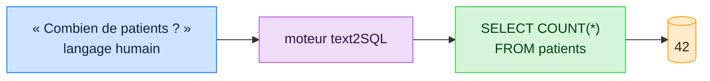
```mermaid
flowchart LR
    Q["« Combien de patients ? »<br/>langage humain"] --> M["moteur text2SQL"] --> S["SELECT COUNT(*)<br/>FROM patients"] --> R[("42")]
    style Q fill:#CCE4FF,stroke:#007AFF,color:#0a2540
    style M fill:#EFDCF8,stroke:#AF52DE,color:#2e1440
    style S fill:#D4F5D9,stroke:#28CD41,color:#0b3d16
    style R fill:#FFEACC,stroke:#FF9500,color:#3d2600
```

> L'idée : vous parlez français, la machine écrit le SQL et vous rend la réponse.

<!-- Le concept en une image. C'est CE que font les 3 approches. -->

***

# ❓ La question que tout le monde pose

> « Le text-to-SQL, concrètement, comment ça marche : et quelle méthode choisir ? »

La plupart des tutos montrent une solution sur une base jouet à 2 tables. Ça n'apprend presque rien sur les vraies décisions.

<!-- Le projet ~/sql est un ARTEFACT PÉDAGOGIQUE. On va montrer les compromis, pas juste « ça marche ». -->

***

# Une vraie base : un hôpital fictif

30 tables, ~33 000 lignes, un vrai parcours de soin.

| Domaine | Exemples de tables |
|---|---|
| 🩺 Médical | `patients`, `diagnostics`, `traitements` |
| 👥 RH | `employes`, `contrats`, `absences` |
| 💶 Compta | `factures`, `paiements` |
| 💊 Pharmacie | `medicaments`, `stocks` |

> ⚠️ 100 % synthétique. Aucune donnée réelle.

<!-- Pourquoi 30 tables : les vraies jointures cassent le text-to-SQL naïf. Une base jouet cacherait le problème. -->

***

# 🧩 C'est quoi une « jointure » ?

Croiser deux tableaux par une colonne commune.

- « le nom du patient » (table `patients`) + « sa facture » (table `factures`)
- reliés par un `patient_id` partagé

> Plus il y a de tableaux à croiser, plus c'est dur : et plus le modèle se trompe.

<!-- La jointure est LÀ où le text-to-SQL difficile se joue. -->

***

# 🔀 Trois approches, côte à côte

| # | Approche | Idée |
|---|---|---|
| 1 | QwenCoder brut | on écrit le prompt nous-mêmes |
| 2 | LangChain | un cadre lit la base pour vous |
| 3 | Vanna (RAG) | on indexe, on ne récupère que l'utile |

… plus Gemma, qui choisit le graphique du résultat, par exemple en JSON Vega-Lite.

<!-- Les trois diffèrent SEULEMENT sur : comment le schéma arrive au LLM. Du plus bas niveau au plus « cadre ». -->

***
# 📊 Gemma choisit la figure, en JSON Vega-Lite

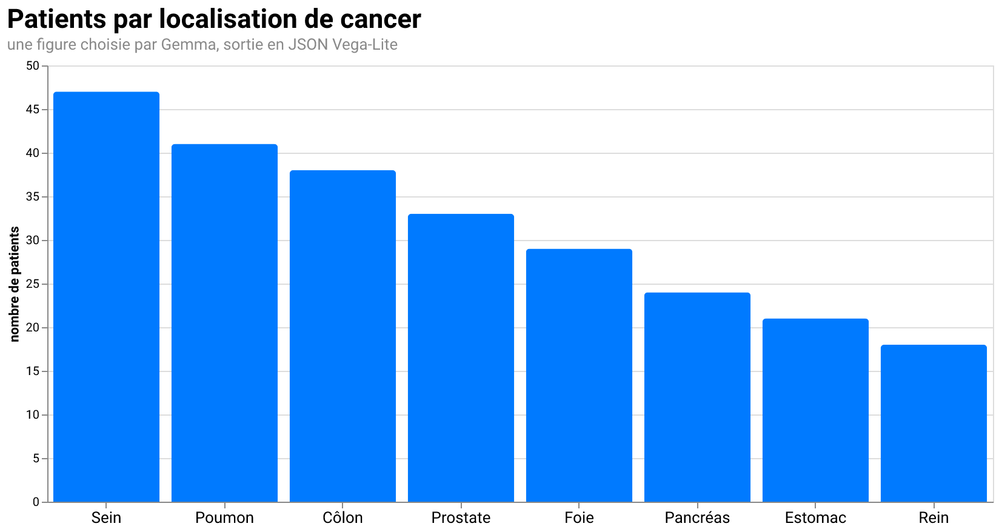

<!-- Gemma produit une SPEC Vega-Lite (déclarative, pas du code exécuté). Exemple ci-dessus. -->
***

# 🧩 C'est quoi un « prompt » ? un « framework » ?

- Prompt = le texte de consigne qu'on donne au LLM (« voici la base, écris le SQL pour… »).
- Framework (LangChain) = une boîte à outils toute faite qui écrit le prompt à votre place.

> Pratique… mais vous ne voyez plus ce qu'elle met dans le prompt.

<!-- Démystifier. Le framework automatise, mais cache. C'est le cœur de la leçon à venir. -->

***

# 🧩 C'est quoi le « RAG » ?

Retrieval-Augmented Generation : au lieu de tout donner au modèle, on lui retrouve juste le passage utile avant de répondre.

- Analogie : un examen livre ouvert : on ne relit pas tout, on va à la bonne page.
- Indispensable quand la base est trop grosse pour tenir dans un prompt.

<!-- Vanna = RAG. On « entraîne » un index (schéma + exemples), on récupère le pertinent à la question. -->

***

# 🎛️ La seule chose qui change

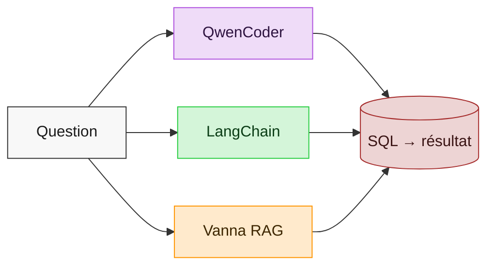
```mermaid
flowchart LR
    Q["Question"] --> QN["QwenCoder"]
    Q --> LC["LangChain"]
    Q --> V["Vanna RAG"]
    QN --> R[("SQL → résultat")]
    LC --> R
    V --> R
    style Q fill:#F8F8F8,stroke:#333333,color:#1a1a1a
    style QN fill:#EFDCF8,stroke:#AF52DE,color:#2e1440
    style LC fill:#D4F5D9,stroke:#28CD41,color:#0b3d16
    style V fill:#FFEACC,stroke:#FF9500,color:#3d2600
    style R fill:#EDD4D4,stroke:#A52A2A,color:#3a1414
```

Même base, même modèle local, même garde-fou. Seul diffère : comment le schéma atteint le LLM.

> 🎓 La leçon (1/2) : ce qui décide la qualité, ce n'est pas le cadre, c'est le contexte qu'on donne au modèle.

<!-- On isole UNE variable. Chaque approche montre le SQL généré → on LIT la différence. -->

***

# 🧩 Comment on « mesure » ici

Execution accuracy : le SQL généré renvoie-t-il le même résultat que le SQL de référence ?

- On ne compare pas le texte, on compare la réponse.
- Standard du domaine (benchmarks Spider / BIRD).

> Mesurer, ce n'est pas donner un avis, c'est compter.

<!-- Définir la métrique avant de montrer des chiffres. -->

***

# On mesure : 768 requêtes

- 768 questions équilibrées : 256 Faciles / 256 Moyennes / 256 Difficiles
- Le même LLM partout (`qwen2.5-coder`, en local)
- Reproductible en une commande

> On compare des approches, pas des modèles. L'écart vient du contexte, pas d'un meilleur cerveau.

<!-- Même LLM pour les 5 configs. Le spread de qualité vient uniquement du contexte fourni. -->

***

# 🧩 Trois approches → cinq configurations

| Config | Ce qui change |
|---|---|
| QwenCoder naïf | schéma brut + question, sans guidance, sans correction |
| QwenCoder bon | + types de colonnes, valeurs énumérées, exemples, auto-correction |
| LangChain | le cadre construit le prompt à votre place (sans correction) |
| Vanna 1 | RAG léger : schéma + 4 exemples + auto-correction |
| Vanna 2 | RAG nourri : + valeurs énumérées, 15 exemples + auto-correction |

<!-- Deux paires de contrôle : dans chaque paire une seule variable change : le prompt (Qwen) ou la richesse de l'index (Vanna). Clé de lecture de tous les graphiques qui suivent. La démo web tourne sur Vanna 1 ; Vanna 2 est la config benchmark uniquement. -->

***

# 📶 Pourquoi Facile / Moyen / Difficile

Une moyenne unique cache où un modèle casse.

| Niveau | Compétence | Exemple |
|---|---|---|
| Facile | 1 table, 1 calcul | *« combien de patients ? »* |
| Moyen | regrouper, filtrer | *« CA par mois en 2026 »* |
| Difficile | jointures, sous-requêtes | *« services au-dessus de la masse salariale médiane »* |

> Une méthode ne vaut quelque chose que dans la colonne *difficile*.

<!-- Rampe de difficulté : tout le monde réussit Facile ; les écarts s'ouvrent sur Moyen et explosent sur Difficile. -->

***

# 📶 Facile pour tous ; l'écart se creuse sur le *difficile*

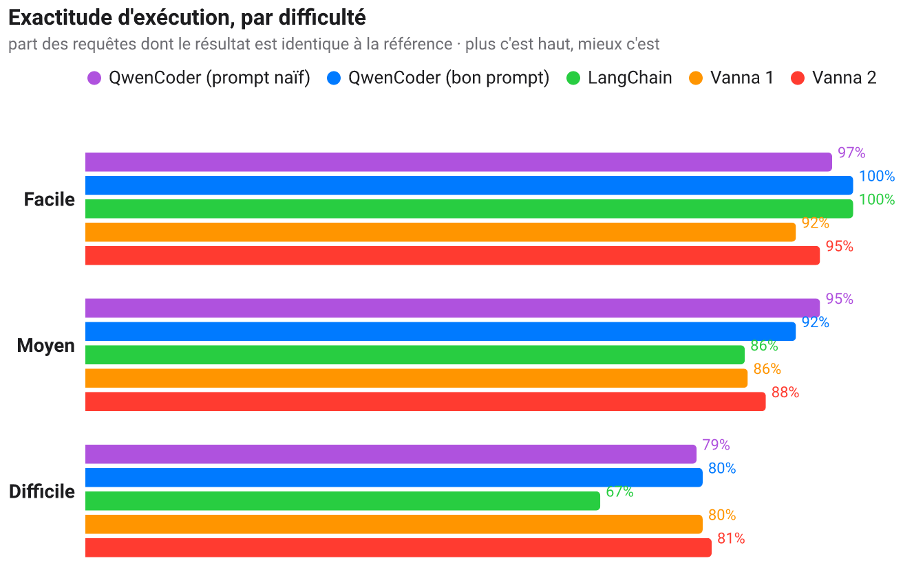{height=4.7in}

<!--
Légende (à dire) : Tout le monde est bon en Facile ; les écarts se creusent en Difficile.
Figure de front-figures. Le RAG « bien nourri » (Vanna 2) finit meilleur sur Difficile (81%) : la récupération ciblée paie quand la requête est complexe.
-->
***

# Deux façons d'avoir faux

Toutes les erreurs ne se valent pas.

- 🔴 Erreur d'exécution : le SQL est invalide, la base refuse.
- 🟡 Erreur sémantique : le SQL marche… mais répond à la mauvaise question.

<!-- Mise en place du point le plus important de la Partie 2. -->

***

# 🕵️ Le tueur silencieux

- 🔴 L'erreur d'exécution est bruyante → rattrapable (log, retry).
- 🟡 L'erreur sémantique renvoie un tableau plausible, sans alerte. Un humain recopie le chiffre. Personne ne voit.

> 🎓 La leçon (2/2) : le vrai jeu, c'est de transformer les erreurs sémantiques en erreurs d'exécution (ou en bonnes réponses).

<!-- Une requête invalide est une nuisance ; une requête confidemment fausse est une RESPONSABILITÉ. -->

***

# Le danger, c'est le jaune : l'erreur sémantique, silencieuse

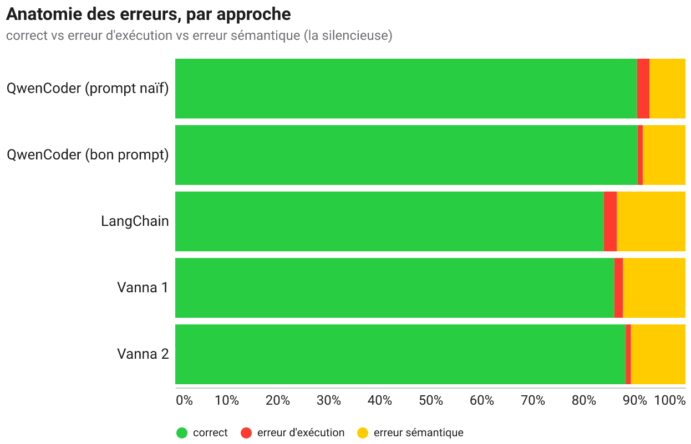{height=4.7in}

<!--
Légende (à dire) : 🟢 correct · 🔴 exécution (bruyant, rattrapable) · 🟡 sémantique (silencieux, dangereux). Moins de jaune = plus de confiance.
LangChain : rapide mais 103 erreurs sémantiques, pas de réparation. « La vitesse n'est pas la sûreté. »
-->
***

# 🧩 C'est quoi « l'auto-correction » ?

Quand la base refuse le SQL, on renvoie le message d'erreur au modèle pour qu'il se corrige.

- Une 2ᵉ tentative, guidée par l'erreur réelle.
- Écrase la plupart des erreurs d'exécution.

> Le prix : une génération de plus → plus lent.

<!-- Les 2 configs avec réparation (bon QwenCoder + Vanna 2) tombent à 8 erreurs invalides. -->

***

# ⚖️ Personne ne gagne sur les deux axes

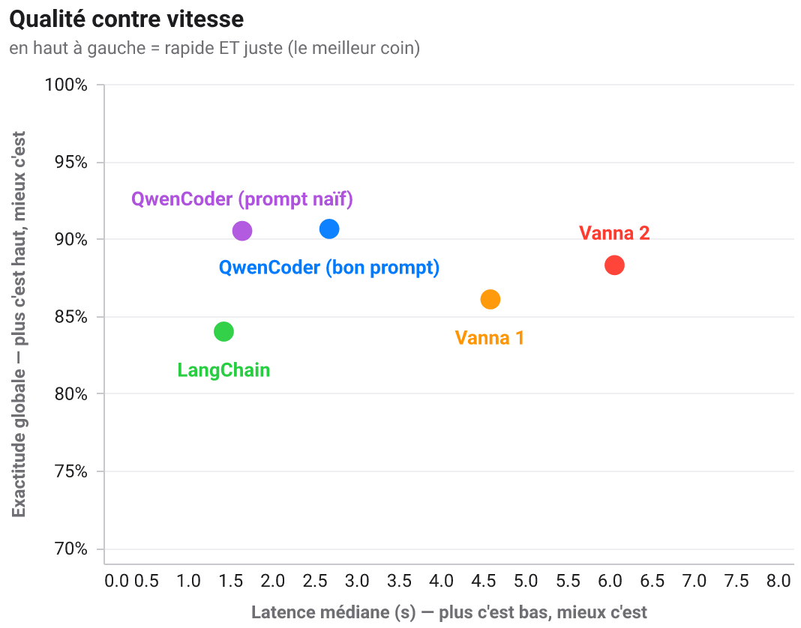{height=4.7in}

<!--
Légende (à dire) : Aucune config ne gagne sur les deux axes. La fiabilité a un prix.
LangChain = le plus rapide, le moins sûr. Vanna 2 = le plus précis sur Difficile, mais le plus lent. Compromis à assumer.
-->
***

# 🧩 C'est quoi « Vega-Lite » / une « spec » ?

Décrire un graphique en le déclarant (type, axes, données), pas en le programmant.

- Une recette de données, pas du code exécuté.
- Le navigateur la dessine.

> Un modèle peut produire cette recette sans danger : elle est inerte.

<!-- Prépare la sécurité : le LLM produit une spec Vega-Lite, jamais du code exécuté. -->

***

# 📊 Le modèle choisit le graphique

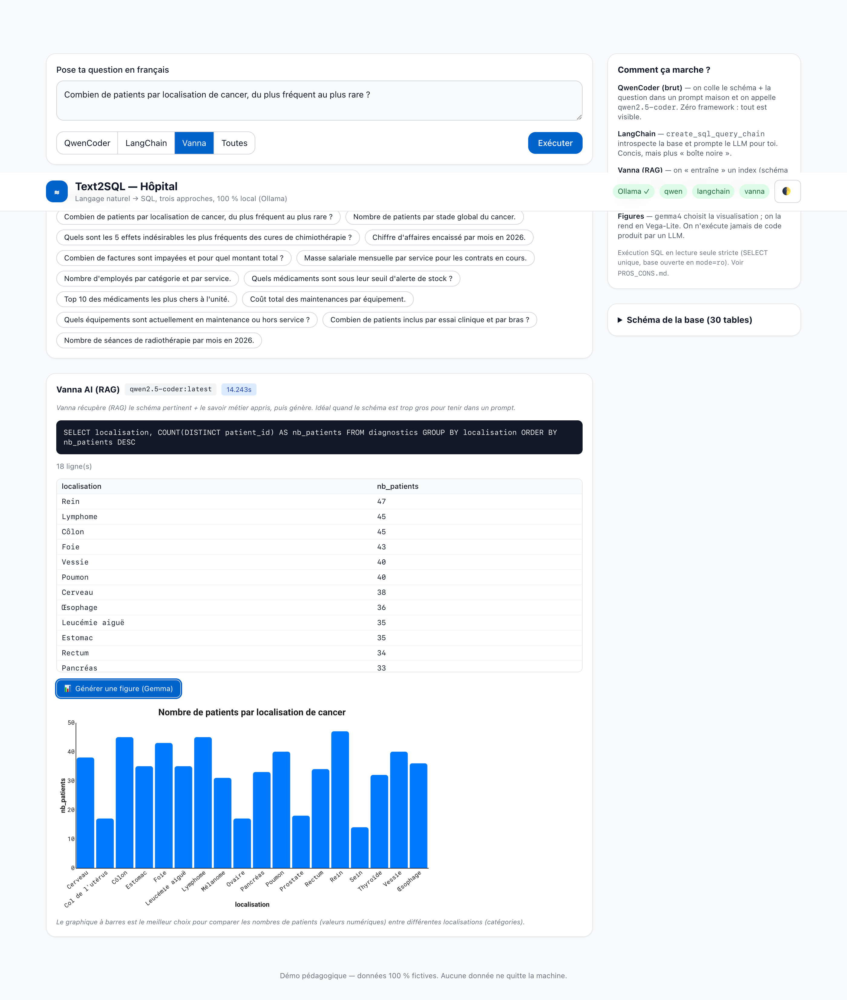{height=4.7in}

<!--
Légende (à dire) : Le résultat SQL → un modèle (Gemma) choisit le bon graphique → une recette Vega-Lite dessinée dans le navigateur.
Lien avec front-figures / Vega-Lite. Sécurité : on ne fait JAMAIS exec() de code généré par LLM.
-->
***

# 🧩 Sécurité : ne jamais exécuter le code d'un LLM

Un LLM peut se tromper, ou être manipulé par une question piégée.

- RCE = exécution de code à distance : le cauchemar sécurité.
- Vanna a eu une faille connue (CVE) exactement là-dessus.

> Donc : le SQL généré n'est jamais lancé aveuglément.

<!-- RCE = Remote Code Execution. Motive les garde-fous suivants. -->

***

# 🔒 Les garde-fous

Tout passe par une couche unique :

- connexion lecture seule (impossible de modifier la base)
- un seul `SELECT` autorisé, mots-clés d'écriture rejetés
- une limite défensive sur les résultats

> On montre les garde-fous, pas seulement la magie.

<!-- Pédagogie de sécurité appliquée. Motivé par le CVE de Vanna. -->

***

# 🍒 Où ça atterrit, et c'est essentiel

Ce projet est pédagogique, mais l’atterrissage n’est pas un bonus : déjà en production chez vous, dans `sev7n-equipier-data`.

Un text-to-SQL 4 couches sur base métier :

1. catalogue de schéma en direct
2. sémantique métier
3. RAG schéma + exemples
4. boucle vérifie / corrige

<!-- L'équipier « Data » fait ce text-to-SQL sur VOS bases. La Partie 2 = la théorie ; l'équipier Data = la version industrialisée. -->

***
# 🏆 Quand le RAG gagne : petit vs gros schéma

Sur la petite base, le prompt schéma-complet mène. Gonflez le schéma ×18 (colonnes de décor) → il déborde le contexte du modèle.

> 🎓 Mesuré : les approches « à prompt » s'effondrent, le RAG tient : c'est le mécanisme du text-to-SQL 4 couches de l'équipier Data.

<!--
Justifie CONCRÈTEMENT le RAG de l'équipier Data. Petit schéma → prompt complet suffit ; gros schéma réel
(milliers de colonnes) → RAG nécessaire. Mesuré, plus seulement affirmé.
-->
***
# L'inversion, mesurée

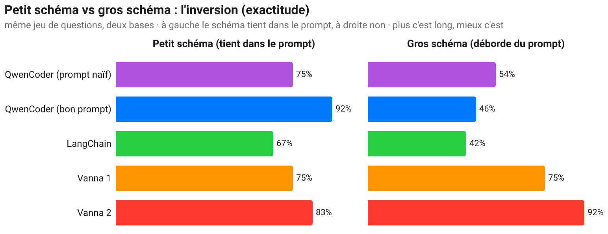

<!--
Légende (à dire) : petit schéma qwen 92 % en tête ; gros schéma il tombe à 46 % et vanna_plus (RAG) mène à 92 %.
Le classement s'inverse. Échantillon n=24 : on lit la tendance, pas la 3e décimale.
-->
***

# 🔍 Trois approches, le SQL affiché à chaque fois

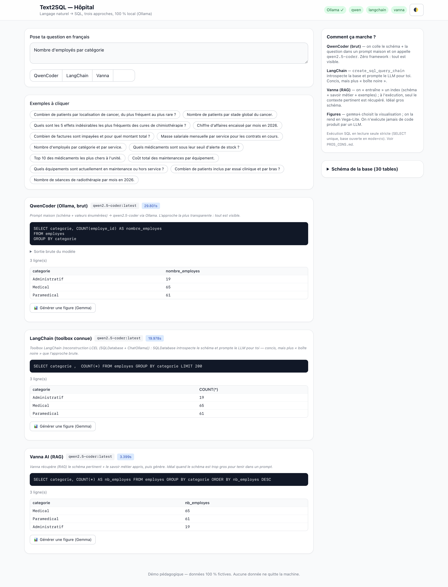{height=4.7in}

<!--
Légende (à dire) : Les approches côte à côte, sur la même question, avec le SQL généré à chaque fois. On lit la différence.
DÉMO LIVE possible : ~/sql ./start.sh → http://localhost:8000, poser une question, « Toutes ».
-->
***

# Partie 3 · moteur d'intention {.big}

## 40 ans d'IA du langage, côte à côte

<!-- Section divider. Cœur ML/DS/AI = mon métier. Pédagogue pour les non-ML, substance pour les techs. Démo live. -->

***

# 🧩 C'est quoi « comprendre l'intention » ?

Deviner ce que veut quelqu'un à partir de sa phrase, pour l'orienter.

- « ma voiture est cabossée » → intention : déclarer un sinistre auto
- → router vers le bon service, extraire les infos utiles

> C'est le cerveau d'un chatbot ou d'un standard téléphonique.

<!-- NLP = Traitement Automatique du Langage. « Intent detection » = classer une phrase dans une catégorie d'action. -->

***

# Le cas : le chatbot d'un assureur

Un client écrit :

> *« J'ai eu un accident ce matin, ma voiture est cabossée. »*

Le système doit :

1. comprendre l'intention → `declarer_sinistre_auto`
2. router vers le bon service
3. extraire les infos (urgence, type de bien)

<!-- Cas concret : le routage d'un assureur fictif (Déraison Assurances). 5 moteurs font ce travail. -->

***

# Le vrai problème : le sens, pas les mots

Les clients paraphrasent :

- « on m'a rentré dedans »
- « mon pare-brise est fissuré »
- « accrochage au feu rouge »

→ Aucun ne contient les mots de l'exemple d'entraînement. Il faut saisir le sens.

<!-- La paraphrase est le test. Un système qui ne connaît que les mots exacts échoue. C'est TOUTE la Partie 3. -->

***

# 🕰️ 5 moteurs sur 40 ans d'IA du langage

| # | Moteur | Représentation | Classifieur |
|---|---|---|---|
| 1 | TF-IDF | n-grammes creux (TF-IDF) | Random Forest |
| 2 | fastText appris | sous-mots appris sur nos exemples | softmax intégré |
| 3 | fastText pré-entraîné | cc.fr.300 (300 dim., Common Crawl) | régression logistique |
| 4 | BERT | SBERT (384 dim., contextuel) | MLP PyTorch |
| 5 | LLM local | prompt (JSON strict) | Gemma / qwen via Ollama |

<!-- La table SE LIT comme l'histoire du domaine : du sac-de-mots au génératif. -->

***

# 🧩 C'est quoi « TF-IDF » / le sac de mots ?

On compte les mots d'une phrase, en pondérant les rares (plus informatifs).

- La phrase devient une liste de fréquences.
- Ne connaît que les mots vus. Un synonyme jamais vu est invisible.

> Rapide et robuste… mais aveugle au *sens*.

<!-- TF-IDF = Term Frequency - Inverse Document Frequency. Le point de départ historique. -->

***

# 🧩 C'est quoi un « embedding » ? (LE concept)

Transformer un mot / une phrase en un point dans un espace, où le sens = la position.

- voiture et véhicule → points proches
- voiture et banane → points éloignés

> On peut alors mesurer une distance de sens. C'est la clé de tout le reste.

<!--
LE concept central de la Partie 3 et de tout le NLP moderne. Prendre le temps.
Analogie : une carte où les villes proches se ressemblent.
-->

***

# 🧩 fastText : appris vs pré-entraîné

- Appris : on fabrique les embeddings à partir de nos seuls exemples (quelques centaines).
- Pré-entraîné : on importe des embeddings appris sur des milliards de mots français.

> Importer un savoir tout fait = transfer learning. Gratuit et puissant.

<!-- Transfer learning : le pré-entraîné connaît déjà « voiture ≈ véhicule » sans qu'on le lui montre. -->

***

# 🧩 C'est quoi « BERT » ?

Un modèle qui produit des embeddings selon le contexte de la phrase entière.

- « avocat » (le fruit) ≠ « avocat » (le juriste), BERT distingue.
- Comprend les paraphrases là où compter les mots échoue.

> Plus lourd, mais sémantique. Tourne quand même en local.

<!-- SBERT = Sentence-BERT. Embeddings contextuels de phrase. La marche sémantique. -->

***

# 🧩 Réseau de neurones ? Random Forest ?

Deux façons d'apprendre une décision à partir d'exemples :

- Random Forest = une assemblée d'arbres de règles qui votent.
- Réseau de neurones = des couches de calcul qui apprennent des motifs.

> Ce sont les classifieurs posés au-dessus des représentations.

<!-- Léger, juste pour situer. Le message clé arrive : la représentation compte plus que ce classifieur. -->

***

# La leçon, en un graphe

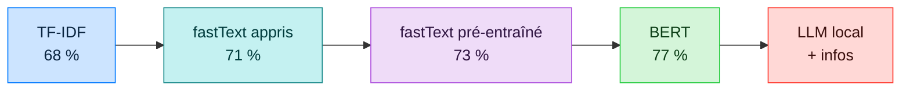
```mermaid
flowchart LR
    A["TF-IDF<br/>68 %"] --> B["fastText appris<br/>71 %"] --> C["fastText pré-entraîné<br/>73 %"] --> D["BERT<br/>77 %"] --> E["LLM local<br/>+ infos"]
    style A fill:#CCE4FF,stroke:#007AFF,color:#0a2540
    style B fill:#C4F1F1,stroke:#1D8C8D,color:#003b3c
    style C fill:#EFDCF8,stroke:#AF52DE,color:#2e1440
    style D fill:#D4F5D9,stroke:#28CD41,color:#0b3d16
    style E fill:#FFD8D6,stroke:#FF3B30,color:#3a0f0d
```

> 🎓 La leçon : sur des paraphrases, la précision monte 68 → 71 → 73 → 77 → 79 %. Ce qui change ? La représentation, puis le modèle.

<!-- Écho parfait de la Partie 2 : là « le contexte » ; ici « la représentation ». Même méthode : isoler une variable, mesurer. -->

***

# L'idée centrale : le savoir vit en Markdown

Un titre `#` = une intention. Un expert métier en ajoute une sans toucher au code :

```markdown
# declarer_sinistre_auto
> Service : Sinistres auto
## Exemples
- J'ai eu un accident de voiture
- Mon pare-brise est fissuré
```

Les exemples nourrissent les 5 moteurs à la fois.

<!-- Point opérationnel : la base de connaissance est du Markdown. Un métier édite, pas un dev. Écho à md2star. -->

***

# Une phrase, cinq moteurs : la différence se lit

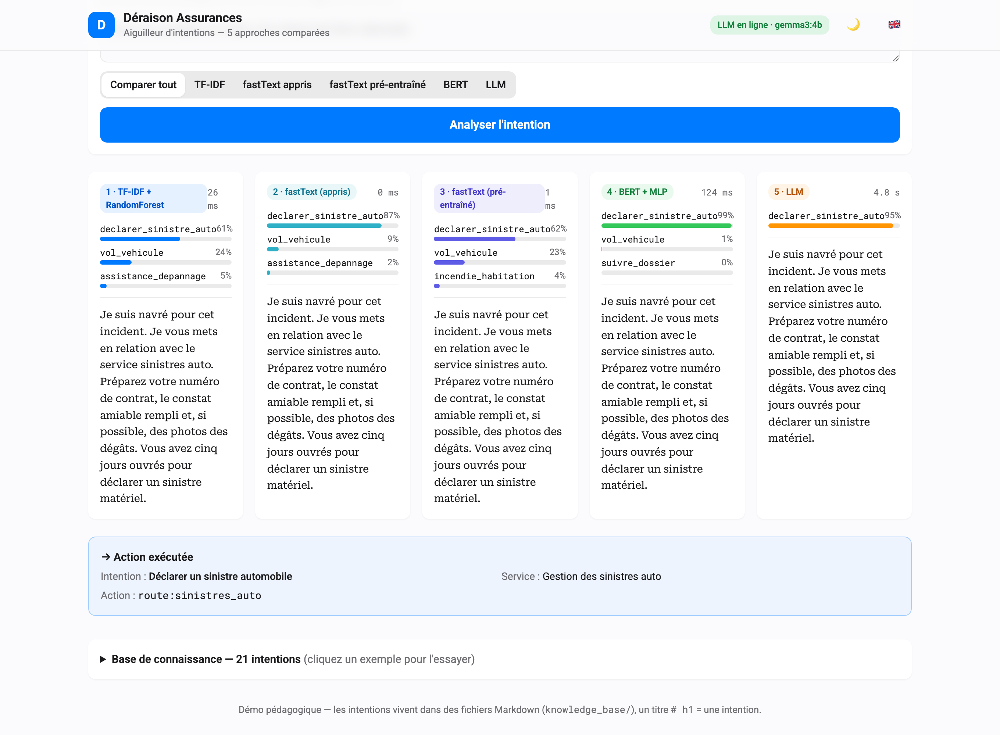{height=4.7in}

<!--
Légende (à dire) : Une phrase, les cinq moteurs côte à côte : prédiction, confiance, latence, infos extraites, action.
DÉMO LIVE : taper une paraphrase, « Comparer tout ». Les moteurs lexicaux s'effondrent, les sémantiques tiennent. Capture live faite aujourd'hui. UI bilingue, bâtie avec front.
-->
***

# 📊 Les résultats mesurés

| # | Moteur | Précision | Temps / appel | Infos |
|---|---|---:|---:|:---:|
| 1 | TF-IDF | 68 % | ~50 ms | ❌ |
| 2 | fastText appris | 71 % | ~33 µs | ❌ |
| 3 | fastText pré-entraîné | 73 % | ~250 µs | ❌ |
| 4 | BERT | 77 % | ~20 ms | ❌ |
| 5 | LLM local | 63-79 % | ~5 s | ✅ |

<!-- La colonne « Infos » (slots) : seul le LLM extrait des champs structurés. -->

***

# ⚡ Une surprise de vitesse

> Le TF-IDF « classique » (~50 ms) est le plus lent des non-LLM.

Des centaines d'arbres coûtent plus cher que les deux multiplications de BERT (~20 ms).

> 🎓 « Vieux » ≠ rapide, « neuronal » ≠ lent. Mesurez, ne supposez pas.

<!-- Leçon d'honnêteté mesurée. La forêt Random Forest coûte plus que la tête neuronale. -->

***

# 🧩 Mesurer l'incertitude : validation croisée

Un seul chiffre peut être un coup de chance. On mesure plusieurs fois :

- Validation croisée : on entraîne / teste sur des découpages différents des données.
- Violon : le dessin de toute la distribution des scores, pas juste la moyenne.

<!-- Culture statistique. Bootstrap + k-fold = 25 mesures par classifieur. Le violon montre la dispersion. -->

***

# La représentation fait grimper la précision : 68 → 79 %

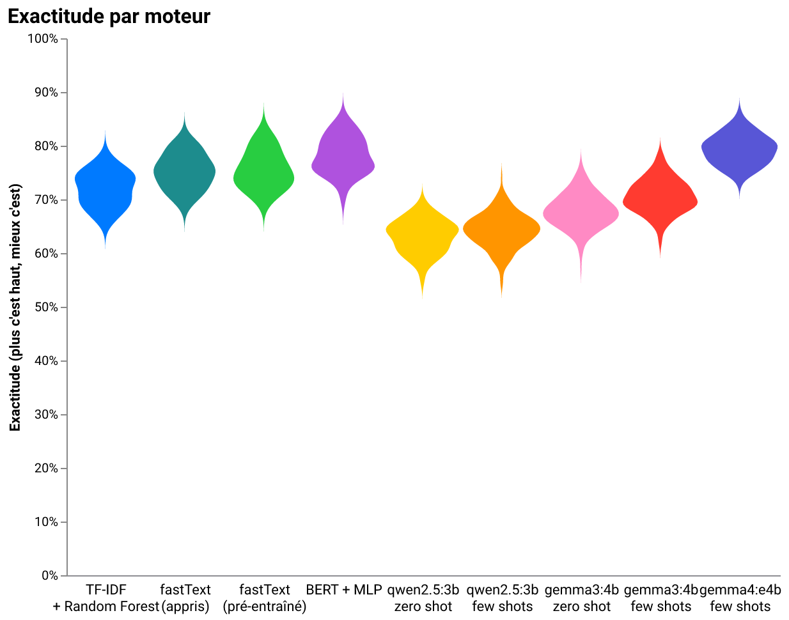{height=4.7in}

<!--
Légende (à dire) : Chaque classifieur : 25 mesures (violons). Les LLM zéro-entraînement : une seule ligne.
Deux lentilles : sur paraphrases 51→86 ; en « conditions faciles » (CV), les moteurs sont plus proches, le lexical va bien quand le test ressemble à l'entraînement et s'effondre sous la paraphrase.
-->
***

# 🧩 Comment lire une matrice de confusion

Un tableau vrai (lignes) × prédit (colonnes).

- La diagonale = les bonnes réponses.
- Hors diagonale = les confusions (quoi pris pour quoi).

> Plus la diagonale est nette, meilleur est le moteur.

<!-- Outil de diagnostic : une précision cache le COMMENT de l'échec. -->

***

# Où chaque moteur se trompe

Une matrice par moteur. Je passe vite : ce qui compte, c'est que la diagonale se resserre du lexical vers le sémantique.

<!-- Lead-in des 8 matrices. La diagonale = les bonnes réponses. Le lexical disperse et s'abstient ; BERT + LLM = diagonale nette. -->

***

# Les erreurs de TF-IDF

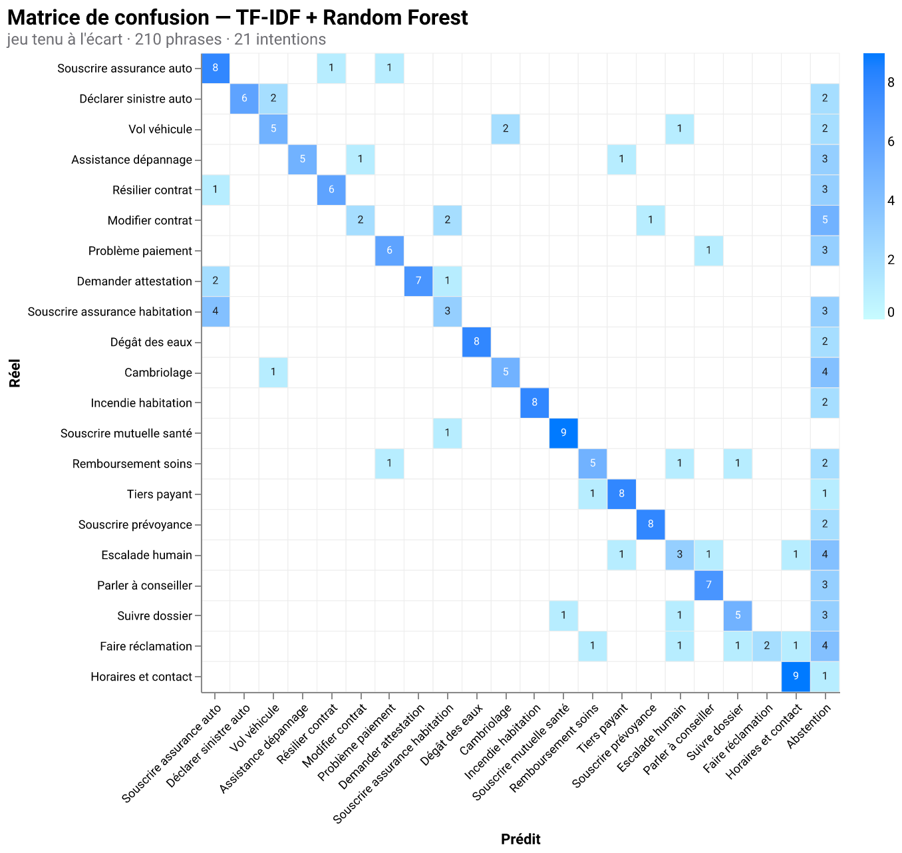{height=4.7in}

<!-- Diagonale floue, beaucoup d'Abstain : le sac de mots se perd sur les paraphrases. -->

***

# Les erreurs de fastText appris

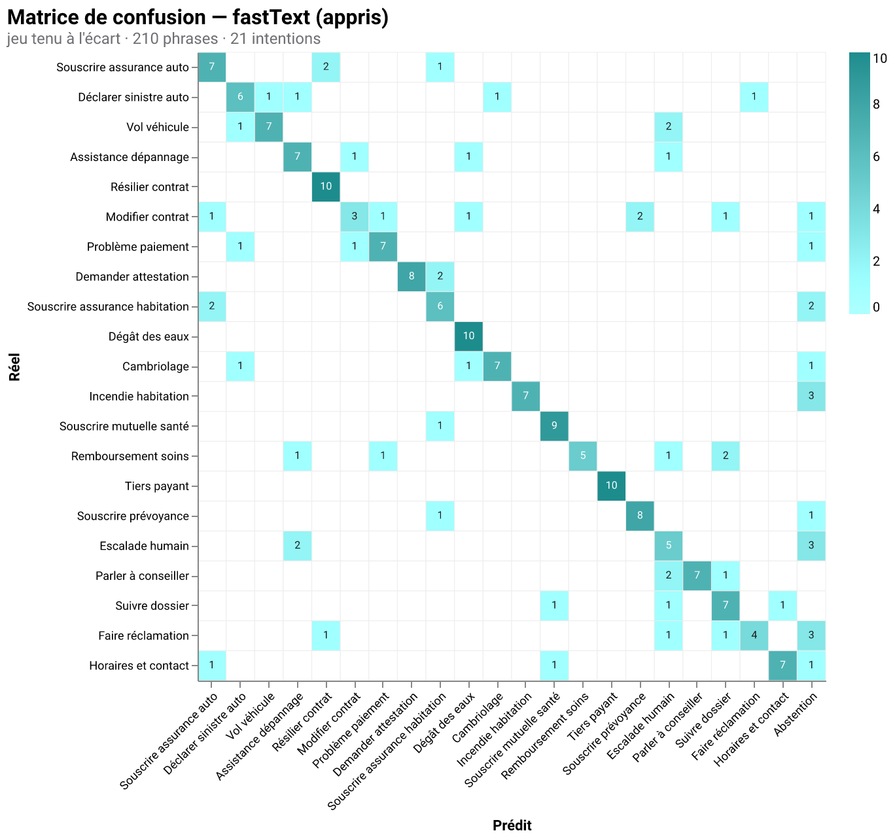{height=4.7in}

<!-- Un cran mieux, mais encore dispersé. -->

***

# Les erreurs de fastText pré-entraîné

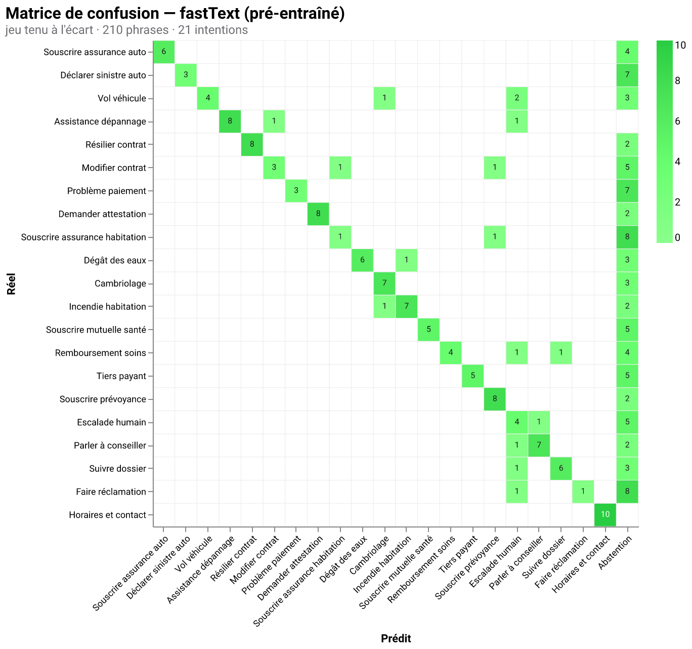{height=4.7in}

<!-- Le savoir importé (cc.fr.300) resserre la diagonale. -->

***

# Les erreurs de BERT

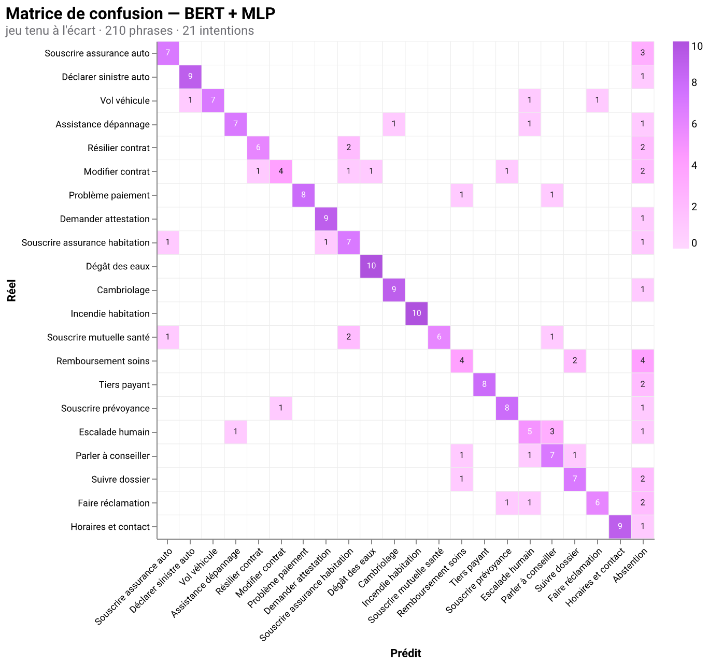{height=4.7in}

<!-- Diagonale quasi propre : la représentation contextuelle paie. -->

***

# Les erreurs de LLM qwen · zéro-shot

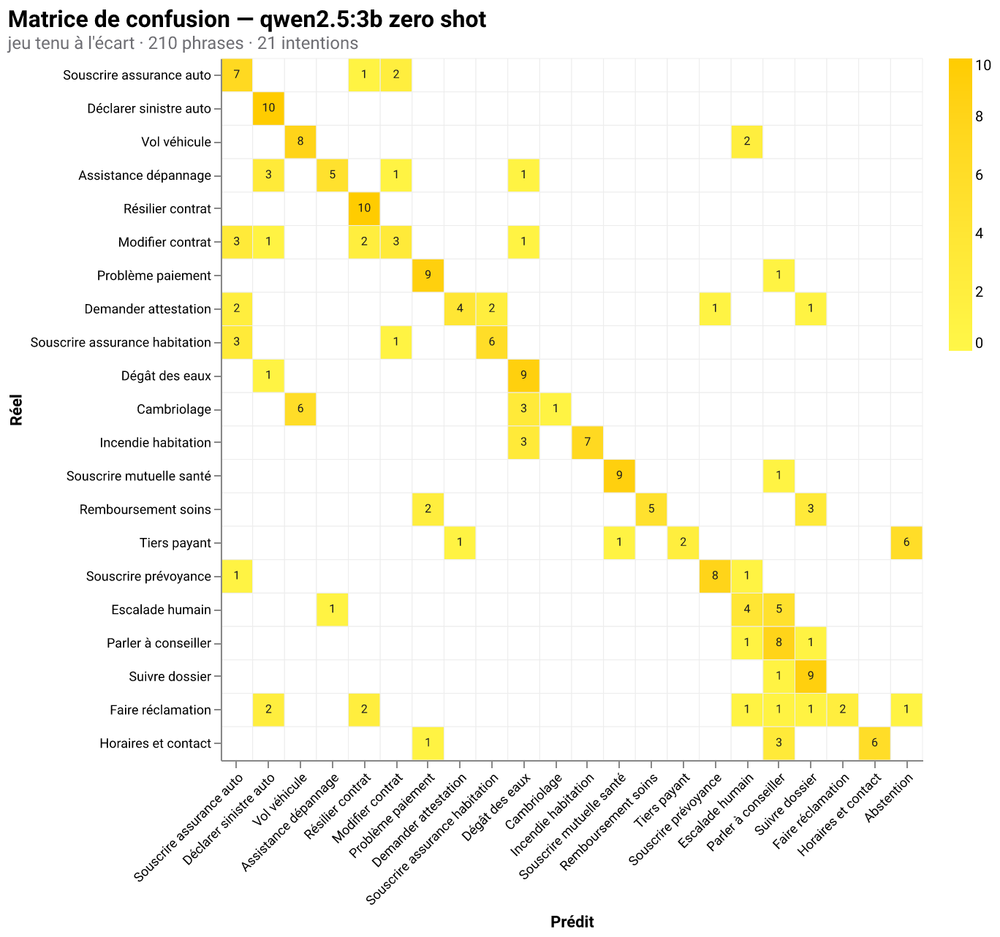{height=4.7in}

<!-- Petit modèle, aucun exemple : correct mais confusions. -->

***

# Les erreurs de LLM qwen · few-shot

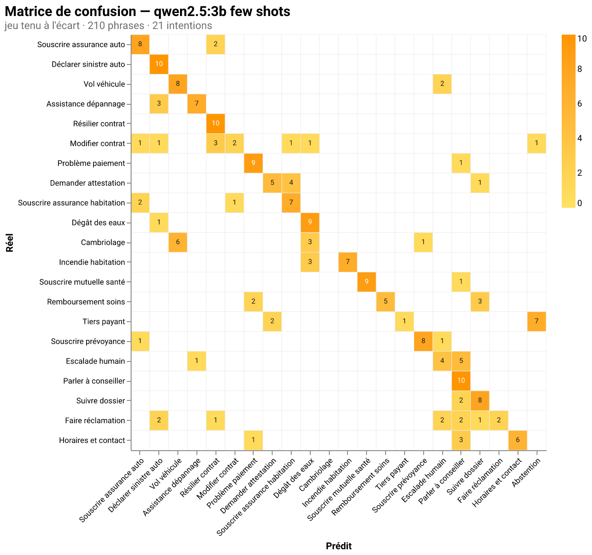{height=4.7in}

<!-- Quelques exemples frais → la diagonale se renforce. -->

***

# Les erreurs de LLM Gemma · zéro-shot

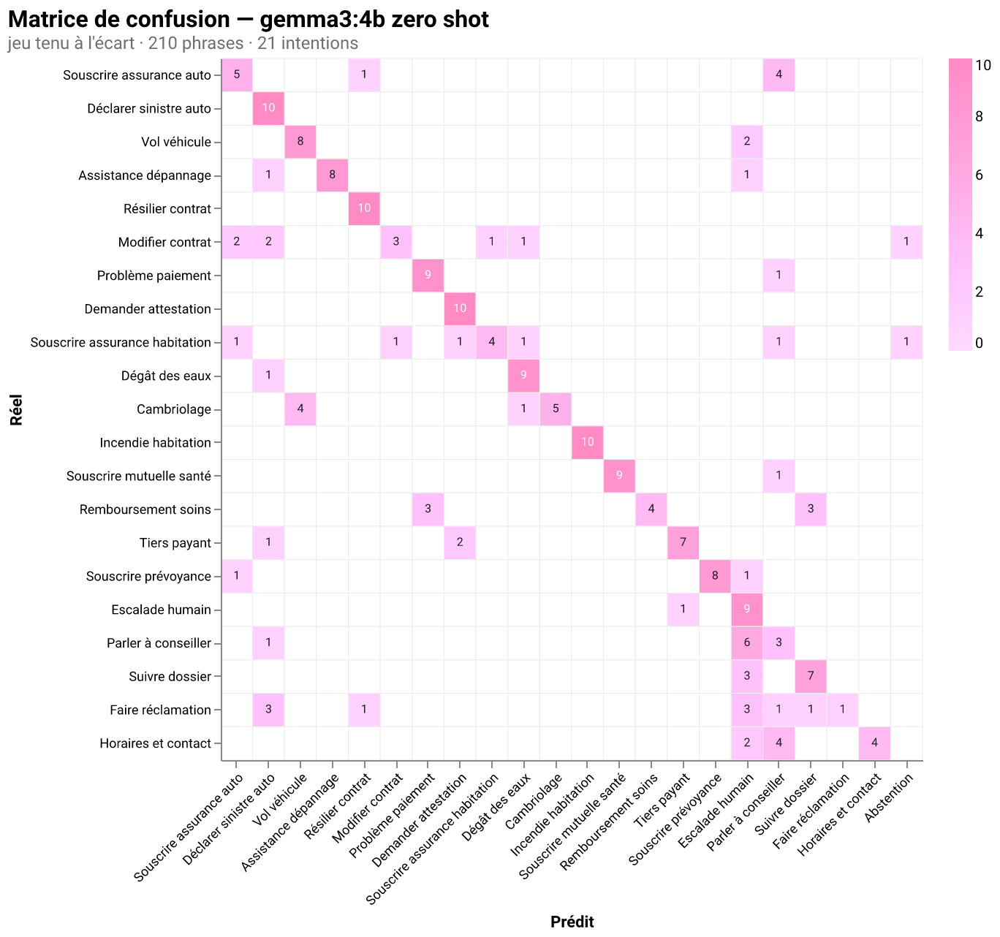{height=4.7in}

<!-- Modèle plus fort : nette amélioration sans aucun exemple. -->

***

# Les erreurs de LLM Gemma · few-shot

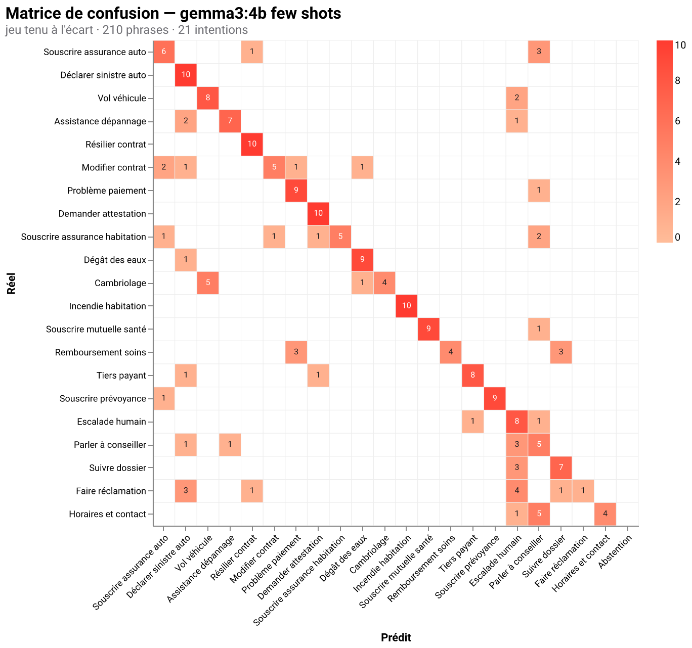{height=4.7in}

<!-- Modèle fort + exemples frais : la diagonale la plus nette. -->

***

# 🧩 C'est quoi la « calibration » ?

Un modèle est bien calibré si sa confiance correspond à sa justesse réelle.

- Mal calibré = sûr de lui même quand il a tort.
- Danger : on croit une réponse fausse.

<!-- Vraie leçon ML. Prépare le point suivant : le meilleur en précision peut être le pire pour dire « je ne sais pas ». -->

***

# 🙋 Le filet de sécurité : savoir s'abstenir

Sur des questions hors-sujet (météo, cuisine…) :

- TF-IDF s'abstient ~93 % du temps ✅
- BERT est trop sûr de lui : ~73 % seulement

> 🎓 Le plus précis des cinq moteurs est le pire pour dire « je ne sais pas ». En prod, l'abstention vaut de l'or.

<!-- Calibration en pratique. « Passer la main à un humain » est une fonctionnalité, pas un échec. -->

***

# 🧩 C'est quoi un « contrat » ?

Un champ structuré extrait de la phrase, prêt pour un logiciel métier.

```json
{ "intent": "declarer_sinistre_auto",
  "type_bien": "auto",
  "urgence": "haute" }
```

> Seul le LLM fait ça. Un classifieur donne une étiquette, pas des champs.

<!-- Slots = extraction d'entités. Alimente un CRM / un standard téléphonique en aval. -->

***

# 🤖 Le modèle pèse plus que les exemples

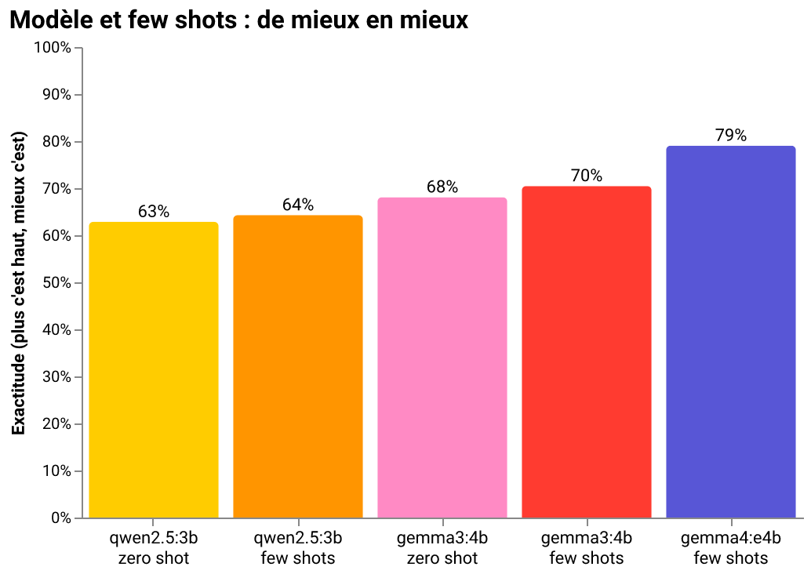{height=4.7in}

<!--
Légende (à dire) : Deux leviers sur le LLM : 63 → 64 → 68 → 70 → 79 %. Le modèle achète le grand saut (jusqu'à gemma4:e4b) ; les exemples ajoutent par-dessus. > D'abord un modèle plus fort, ensuite des exemples frais (sinon on triche sans le savoir).
Zéro-shot vs few-shot. Les exemples doivent être hors du test, sinon c'est du « leakage » (fuite).
-->
***
# 🤖 Et un gros LLM ? Il repasse devant BERT

Le petit `gemma3:4b` (70 %) passait sous BERT (77 %). Un gros LLM local le dépasse :

- `gemma4:e4b` → 79 % · `gemma4:12b` → ~78 % (mêmes phrases held-out)

> Le petit LLM était sous-dimensionné : la hiérarchie tient. Prix : des secondes par appel (vs ~20 ms pour BERT).

<!--
Nuance honnête (mesurée cette session) : les LLM ne sont pas « nuls » en intention, le petit modèle était
sous-dimensionné ; un gros LLM local repasse devant BERT. Ranking, pas décimales (test auto-généré).
-->
***

# 🧩 Pourquoi tout ça tourne en local

Une phrase d'assurance peut être une donnée de santé (RGPD art. 9) :

> *« une prise en charge pour l'Institut de cancérologie »* révèle un diagnostic.

L'envoyer à un LLM cloud = exfiltrer exactement ce que la loi protège le plus.

> Ici, tout reste sur la machine.

<!-- La souveraineté n'est pas idéologique : c'est une contrainte légale. Écho au fil rouge local-first. -->

***

# Conclusion · la production {.big}


<!-- Section divider. Répondre à « qu'est-ce que j'industrialise ? ». -->

***

# 🧵 Le fil rouge, récapitulé

| | Partie 2 (SQL) | Partie 3 (Intentions) |
|---|---|---|
| Variable isolée | le contexte | la représentation |
| La thèse | contexte > cadre | représentation > classifieur |
| Le même… | même LLM partout | même base Markdown |
| L'honnêteté | exec vs sémantique | incertitude, calibration |

> Une seule méthode, trois démonstrations.

<!-- La pédagogie condensée. Les deux projets disent la même chose. -->

***

# 🧩 C'est quoi la « CI » ?

Intégration Continue : à chaque modification du code, un robot relance tous les tests automatiquement.

- Si un test casse → build rouge, on est prévenu tout de suite.
- Filet de sécurité contre les régressions.

<!-- CI = Continuous Integration. GitHub Actions ici. Prépare « cordonniers bien chaussés ». -->

***

# 👞 Cordonniers bien chaussés

Nous vendons de l'IA. Alors nous pratiquons les bonnes pratiques que nous recommandons.

Ces projets ne sont pas des maquettes. La CI de la suite `ai-helpers` :

- teste sur Python 3.10 → 3.13
- vérifie que les 11 briques s'importent
- exécute les exemples pour de vrai

<!-- Chaque repo a sa CI (lint + tests). Ingénierie déjà là, pas juste des slides. -->

***

# 🧩 Test unitaire vs évaluation IA

- Test : le code fait-il ce qu'on attend ? (réponse oui/non)
- Éval IA : le modèle se comporte-t-il bien ? (réponse une note)

> Les deux sont obligatoires. Aucun ne remplace l'autre.

<!-- Distinction clé du standard de code. Le test valide le code ; l'éval valide le comportement du modèle. -->

***

# Le standard : tester + évaluer

Deux règles, dans tous les repos :

- Règle 15, tests : couverture, CI verte à chaque envoi, tests déterministes.
- Règle 16, éval IA : jeu de données commité, seuils versionnés, blocage en CI.

> « Ne jamais se fier au *ressenti* comme seule validation. »

<!-- Le gist de standards. Rule 15 (pytest) + Rule 16 (AI-eval). -->

***

# 🧩 Giskard & DeepEval

Deux outils pour noter un système d'IA, automatiquement :

- DeepEval : orienté LLM (pertinence, hallucination…).
- Giskard : robustesse : la réponse résiste-t-elle à une question reformulée ?

> Déjà en place dans `sql` et `intentions`.

<!-- Dans sql : execution accuracy en métrique 100% locale (pas de juge OpenAI). Giskard scanne la robustesse. Idem intentions. -->

***

# 🧩 C'est quoi « Airflow » ?

Un chef d'orchestre de tâches : il décide quoi lancer, quand, dans quel ordre.

- ré-entraîner un modèle chaque nuit
- reconstruire un index, ingérer des données
- relancer si une étape échoue

<!-- Airflow = orchestration. L'agenda automatique des pipelines. Pas encore dans les repos : c'est le cap. -->

***

# 🧩 C'est quoi « MLflow » ?

Le carnet de bord des modèles : il versionne modèles, réglages, métriques.

- « quelle version tourne en prod ? »
- « quel réglage a donné 88 % ? »
- promouvoir un modèle validé vers la production

<!-- MLflow = tracking + registry + serving. « git pour les modèles » + journal d'expériences. -->

***

# 🚀 Industrialiser : le cap MLOps

La démo tourne à la main. Pour la prod :

- Airflow : quand / quoi tourne (orchestration)
- MLflow : quel modèle, quelle version (suivi + registre)

> La CI garantit le code. Airflow + MLflow garantissent le cycle de vie des modèles.

<!-- Honnêteté : ce sont le cap, pas l'existant. Répond pile à « qu'est-ce que j'industrialise ». -->

***

# 👥 Mon travail pour vous : les Équipiers

`sev7n-equipier-data`, une suite d'« équipiers » IA permanents, focus Data.

> *La donnée est la matière première de l'IA. Sans donnée fiable, toute analyse est aveugle.*

- pilotage des sources & pipelines
- qualité, gouvernance, DataOps
- text-to-SQL sur vos bases métier (les 4 couches de la Partie 2)

<!-- Livrable concret. 5 équipiers (Data, IT, PMO, Stratégie, Méthodo) ; les 4 autres consomment ce que Data produit. -->

***

# Où je prototype : Roitelet, mon lab

Un laboratoire IA local-first pour concevoir et tester des systèmes avec le client, avant la prod.

- comparer modèles locaux vs cloud
- tester le routage, la pseudonymisation
- décider : LLM ? RAG ? agent ? … ou rien ?

> *Roitelet* : le petit oiseau qui, bien placé, monte plus haut que l'aigle.

<!-- roitelet = mon lab (deraison.ai). Le client Ollama de sql et intentions vient de là. Le fil qui relie tout mon travail. -->

***

# ☀️ Qu'est-ce qu'on fait lundi matin ?

- ✅ Graphiques : `front` / `front-figures`
- ✅ Documents : `md2star` (Word / PPTX / PDF, API, MCP)
- ⭐ text2SQL : pas une cerise : le cœur de l'équipier Data, sur vos bases
- ⭐ Moteur d'intention : la méthode, transférable dès maintenant

> On l'a appelée « cerise sur le gâteau ». En vrai, c'est le gâteau.

<!-- Reprise des mots du CTO, requalifiée : text2sql + ML = cœur opérationnel, pas bonus. -->

***
# Deux choses à retenir {.big}

1. Une méthode honnête : une variable, mesurée, qu'on lit.

2. Des outils souverains que vous intégrez dès lundi.

> Et pour refermer Gide : la liberté, c'est transmettre le travail accompli, c'est ce qu'on vient de faire ensemble.

Merci, questions ?

<!--
Bookend : rappel du 3e mouvement (meurt de liberté = épanouissement transmis).
La présentation elle-même EST cet acte de transmission. Boucle narrative refermée.
-->
***

# Backup slides {.big}

## Le détail des AI Helpers

<!-- Slides de secours, appelées sur question / si le temps le permet. Focus : vocal-helper. -->

***

# 🎙️ vocal-helper, vue d'ensemble

Un pipeline audio → texte parlé attribué (+ résumé optionnel). 100 % local.

- En direct : flux audio → transcription + résumé en continu
- Hors-ligne : enregistrement complet → meilleure qualité

> Votre voix est parmi vos données les plus personnelles. Elle reste sur votre matériel.

<!-- BSD-3, local-first (whisper.cpp / pyannote / Ollama). Pipeline async producteur/consommateur. -->

***

# 🎙️ vocal-helper, le pipeline

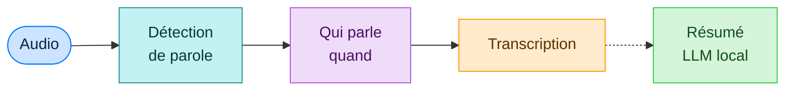
```mermaid
flowchart LR
    S([Audio]) --> V[Détection<br/>de parole] --> D[Qui parle<br/>quand] --> A[Transcription] -.-> L[Résumé<br/>LLM local]
    style S fill:#CCE4FF,stroke:#007AFF,color:#0a2540
    style V fill:#C4F1F1,stroke:#1D8C8D,color:#003b3c
    style D fill:#EFDCF8,stroke:#AF52DE,color:#4a1063
    style A fill:#FFEACC,stroke:#FF9500,color:#5a3300
    style L fill:#D4F5D9,stroke:#28CD41,color:#144d1e
```

Chaque étage tourne à sa cadence ; le résumé LLM est optionnel.

<!-- VAD (Silero) → diarization (TitaNet) → STT (whisper.cpp) → résumé (gemma3:4b). Offline : pyannote sur tout le buffer, transcription batchée (~6.5× plus rapide). -->

***

# AI Helpers, le reste de la suite

- os-helper : fondation : fichiers, config, timing
- audio-helper : charger / convertir / séparer les voix
- speaker-helper : synthèse vocale + clonage de voix
- video / capture-helper : frames de vidéo / caméra + micro
- youtube / podcast-helper : une URL → du son
- bucket / sftp-helper : envoi vers S3 / serveurs

<!-- Vue rapide. Tous BSD-3, tous local-first (sauf bucket/sftp par nature). Même standard de code partout. -->

***

# text2SQL, la méthodologie du benchmark

- 768 requêtes équilibrées ; toutes les références s'exécutent
- On compare les résultats, pas le texte (Spider / BIRD)
- Latence robuste au bruit : plusieurs essais, on garde le minimum

> ⚠️ Mesuré sur un laptop : l'ordre relatif est le signal, pas les valeurs absolues.

<!-- Honnêteté : certaines questions générées « donnent » la valeur du filtre → sous-estiment l'effet d'un bon contexte. Les écarts sont un PLANCHER. -->

***

# 🌐 Tout est public sur GitHub

Les trois projets, dans l'ordre de la présentation :

- md2star : github.com/warith-harchaoui/md2star
- text2SQL : github.com/warith-harchaoui/sql
- moteur d'intention : github.com/warith-harchaoui/intentions

> _What I cannot build. I do not understand._
>
> Ce que je ne peux pas construire, je ne comprends pas.

attribué à Richard Feynman


<!-- Les 3 dépôts sont publics. Ollama + modèles déjà installés localement pour les démos. -->
